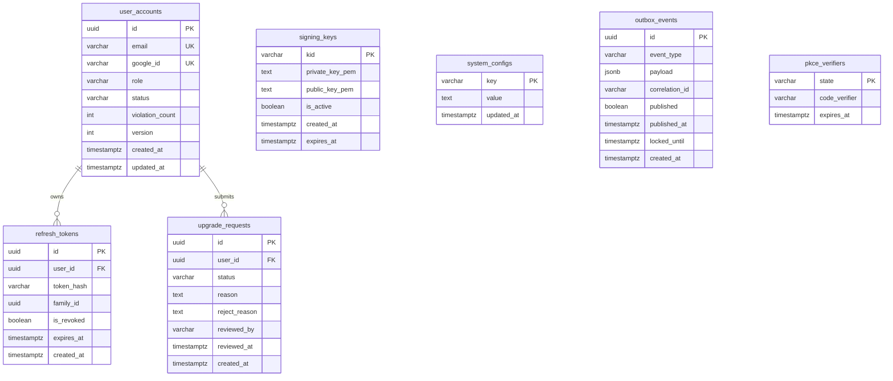
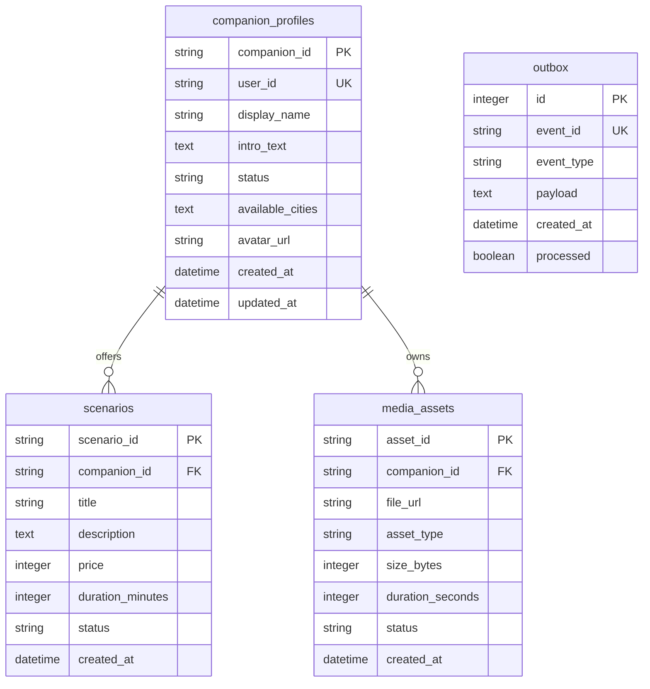
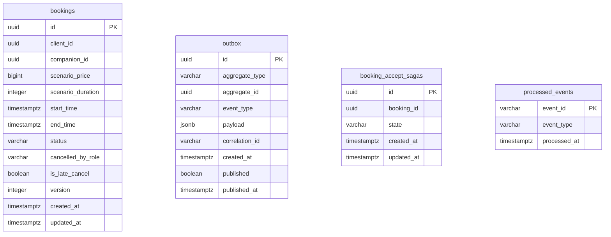
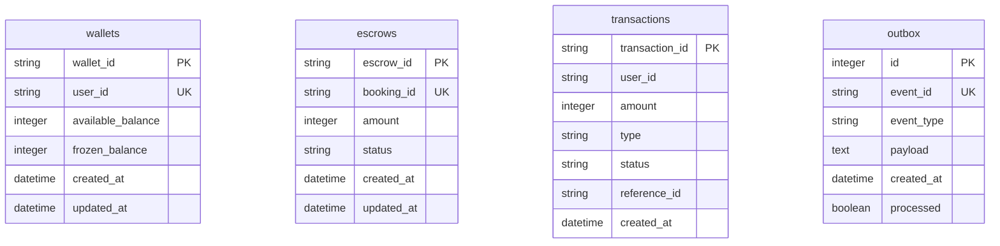
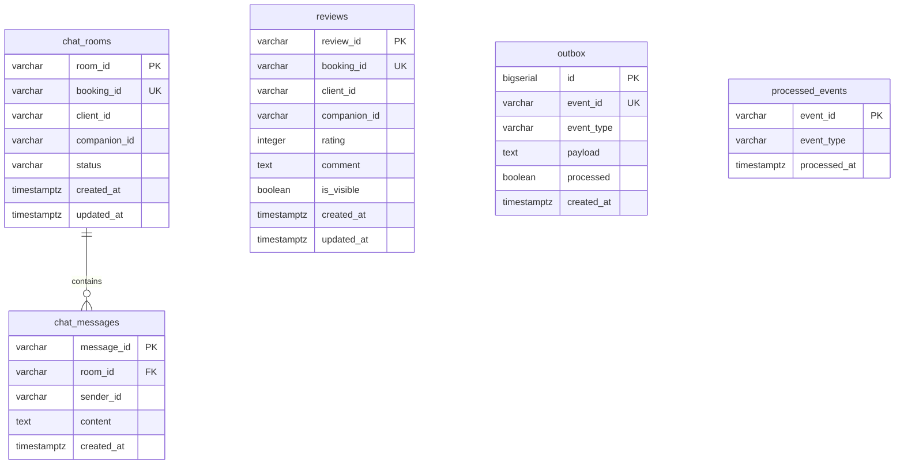
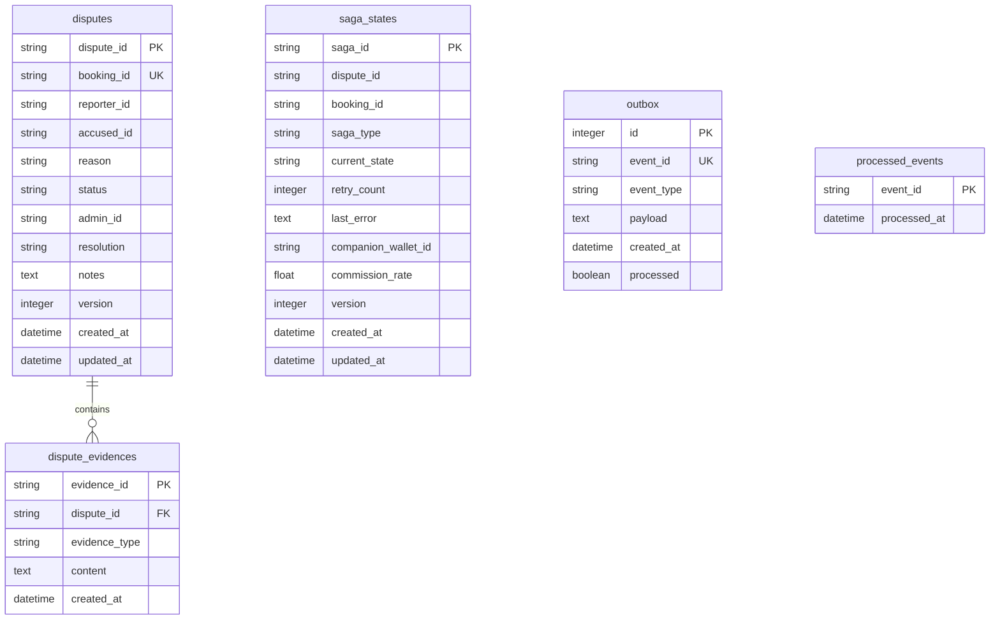
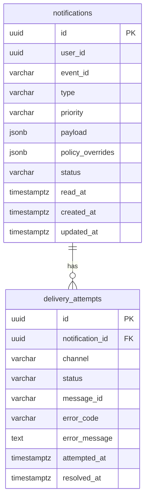

# BÁO CÁO ĐỒ ÁN SOA/MICROSERVICES


## LỜI CẢM ƠN

Lời đầu tiên, em xin gửi lời cảm ơn chân thành và sâu sắc đến Thầy/Cô giảng viên phụ trách môn Kiến trúc Hướng dịch vụ (SOA/Microservices). Những bài giảng, định hướng và phản hồi của Thầy/Cô đã không chỉ truyền đạt kiến thức lý thuyết mà còn giúp em hình thành tư duy thiết kế hệ thống phân tán một cách bài bản và có chiều sâu. Nếu không có nền tảng đó, đồ án này sẽ chỉ dừng lại ở mức một hệ thống backend đơn giản, chứ không thể đạt đến mức độ một hệ thống Microservices thực sự với đầy đủ SAGA, Event Bus và Service Mesh.

Tiếp theo, em xin trân trọng ghi nhận những đóng góp của cộng đồng open-source toàn cầu. Toàn bộ hạ tầng kỹ thuật của dự án — từ Go, Apache Kafka, Kubernetes, đến Istio và Protocol Buffers — đều là thành quả của hàng nghìn kỹ sư trên khắp thế giới đóng góp không vụ lợi. Đây là những công cụ mà các công ty công nghệ hàng đầu như Google, Netflix, Uber, và Shopify sử dụng trong môi trường sản xuất thực tế. Được học và thực hành với những công nghệ này trong môi trường học thuật là một đặc ân lớn.

Cuối cùng, em cảm ơn các tác giả của những cuốn sách nền tảng mà em đã nghiên cứu trong quá trình làm đồ án: "Building Microservices" của Sam Newman, "Domain-Driven Design" của Eric Evans, và "Microservices Patterns" của Chris Richardson. Những tác phẩm này đã định hình cách em nhìn nhận và giải quyết các bài toán kỹ thuật phức tạp, và dấu ấn của chúng hiện diện trong từng quyết định thiết kế của hệ thống.

---

## MỤC LỤC

- [Chương 1. Giới thiệu đề tài](#chương-1-giới-thiệu-đề-tài)
- [Chương 2. Cơ sở lý thuyết](#chương-2-cơ-sở-lý-thuyết)
- [Chương 3. Phân tích và thiết kế hệ thống](#chương-3-phân-tích-và-thiết-kế-hệ-thống)
- [Chương 4. Thiết kế kiến trúc hướng dịch vụ](#chương-4-thiết-kế-kiến-trúc-hướng-dịch-vụ)
- [Chương 5. Xây dựng và triển khai hệ thống](#chương-5-xây-dựng-và-triển-khai-hệ-thống)
- [Chương 6. Kết quả thực nghiệm và đánh giá](#chương-6-kết-quả-thực-nghiệm-và-đánh-giá)
- [Chương 7. Kết luận và hướng phát triển](#chương-7-kết-luận-và-hướng-phát-triển)
- [Tài liệu tham khảo](#tài-liệu-tham-khảo)
- [Phụ lục](#phụ-lục)

---

## DANH MỤC TỪ VIẾT TẮT

Trong báo cáo này, một số thuật ngữ kỹ thuật được viết tắt để tiện trình bày. **SOA** là viết tắt của Service-Oriented Architecture (Kiến trúc Hướng dịch vụ), **DDD** là Domain-Driven Design (Thiết kế Hướng Miền), **gRPC** là Google Remote Procedure Call — framework gọi hàm từ xa hiệu năng cao của Google, **JWT** là JSON Web Token — chuẩn token xác thực dạng JSON, **SAGA** là một pattern xử lý giao dịch phân tán không dùng khóa toàn cục (2-Phase Commit), **SSE** là Server-Sent Events — kỹ thuật server đẩy dữ liệu một chiều đến client qua HTTP, **mTLS** là mutual TLS — phiên bản TLS hai chiều đảm bảo cả client và server đều được xác thực, và **IPN** là Instant Payment Notification — webhook cổng thanh toán gửi về xác nhận kết quả giao dịch.

---

# Chương 1. Giới thiệu đề tài

## 1.1 Bối cảnh và bài toán

### 1.1.1 Bối cảnh xã hội và thị trường

## Bối cảnh xã hội và thị trường

Trong bối cảnh đô thị hóa và nhịp sống hiện đại ngày càng nhanh, nhu cầu tìm kiếm **một người đồng hành cho các hoạt động cụ thể** như đi cà phê, xem phim, tham gia sự kiện hoặc trò chuyện đang xuất hiện rõ hơn, đặc biệt ở nhóm người trẻ tại các thành phố lớn. Đồng thời, người dùng ngày nay cũng đã quen với mô hình **đặt dịch vụ theo nhu cầu trên nền tảng số**, từ gọi xe, giao đồ ăn đến đặt lịch các dịch vụ cá nhân. Điều này cho thấy tiềm năng hình thành một nền tảng kết nối **dịch vụ đồng hành theo kịch bản**, nơi người dùng có thể tìm kiếm, lựa chọn và đặt lịch một trải nghiệm phù hợp với nhu cầu của mình.

Tuy nhiên, khác với các dịch vụ thông thường, dịch vụ đồng hành là một lĩnh vực nhạy cảm vì liên quan trực tiếp đến tương tác giữa con người với con người. Nếu thiếu một cơ chế trung gian đủ chặt chẽ, thị trường này rất dễ phát sinh các vấn đề như hồ sơ giả, hủy hẹn phút chót, quấy rối, giao dịch ngoài nền tảng hoặc tranh chấp thanh toán. Điều đó khiến trải nghiệm của cả người thuê và người cung cấp dịch vụ trở nên thiếu an toàn và thiếu minh bạch.

Từ bối cảnh đó, đề tài **Rent-a-Girlfriend** được xây dựng như một nền tảng kết nối giữa **Client** và **Companion** thông qua các **kịch bản trải nghiệm được thiết kế sẵn**. Hệ thống không chỉ hỗ trợ tìm kiếm, xem hồ sơ, đặt lịch và thanh toán, mà còn tập trung vào các cơ chế đảm bảo an toàn như duyệt hồ sơ Companion, ví nội bộ có escrow, chat gắn với booking và quy trình đánh giá - khiếu nại sau cuộc hẹn. Qua đó, đề tài hướng đến việc mô phỏng một **service marketplace có cơ chế trust & safety**, thay vì chỉ dừng ở một website đặt lịch đơn thuần.

### 1.1.2 Bài toán kỹ thuật

Nhìn từ góc độ kỹ thuật, bài toán này đặt ra nhiều thách thức phức tạp hơn bề ngoài.

Thách thức lớn nhất là **tính nhất quán phân tán**. Một luồng đặt lịch hoàn chỉnh không chỉ liên quan đến một bảng dữ liệu hay một module — nó kéo theo sự phối hợp của ít nhất ba hệ thống độc lập: hệ thống đặt lịch phải tạo booking, hệ thống tài chính phải đóng băng tiền, và hệ thống tương tác phải tạo phòng chat. Ba thao tác này cần được thực hiện một cách nguyên tử — tất cả cùng thành công, hoặc phải có cơ chế bù trừ (compensating transaction) nếu bất kỳ bước nào thất bại.

Thách thức thứ hai là **sự an toàn của dòng tiền nội bộ**. Kano-Coin — đơn vị tiền tệ ảo của hệ thống — không thể bị tạo ra hay biến mất bất hợp lý. Khi Client gửi yêu cầu đặt lịch, một lượng coin chính xác phải được đóng băng khỏi tài khoản. Khi Companion chấp nhận, lượng coin đó chuyển vào trạng thái Escrow — tức là không còn thuộc về Client nhưng cũng chưa về tay Companion. Chỉ khi cuộc hẹn hoàn tất và không có khiếu nại, Payout mới được thực hiện. Một lỗi nhỏ trong logic này có thể gây mất tiền hoặc double-credit — hậu quả không thể chấp nhận được.

Thách thức thứ ba là **khả năng mở rộng theo chiều ngang**. Nền tảng cần phục vụ được nhiều người dùng đồng thời, đặc biệt vào các khung giờ cao điểm buổi tối và cuối tuần. Kiến trúc monolith truyền thống rất khó scale từng phần — nếu tính năng Chat bị quá tải, không thể chỉ scale riêng module Chat mà phải scale toàn bộ ứng dụng, rất lãng phí tài nguyên.

---

## 1.2 Mục tiêu đề tài

Đồ án đặt ra năm mục tiêu cốt lõi, được ưu tiên theo thứ tự triển khai. Mục tiêu quan trọng nhất là **hoàn thiện luồng booking end-to-end** — bao gồm toàn bộ hành trình từ lúc Client tìm kiếm Companion, xem profile, chọn kịch bản, gửi yêu cầu, nạp tiền, cho đến khi cuộc hẹn kết thúc và thanh toán được thực hiện. Luồng này phải hoạt động chính xác và đáng tin cậy ngay cả khi một số thành phần bên trong gặp sự cố tạm thời.

Mục tiêu thứ hai là **bảo vệ đôi bên thông qua cơ chế Escrow và không gian chat riêng tư có thời hạn**. Tiền của Client phải được bảo vệ khỏi rủi ro Companion không xuất hiện, và ngược lại, Companion cũng phải được bảo vệ khỏi rủi ro Client hủy sát giờ gây thiệt hại.

Mục tiêu thứ ba là xây dựng **hệ thống đánh giá minh bạch** — nơi Client có thể để lại nhận xét sau cuộc hẹn, nhận xét đó không thể bị xóa hay sửa, và Admin có thể ẩn nó chỉ khi có tranh chấp được xác nhận. Điều này tạo ra niềm tin giữa các bên trên nền tảng.

Mục tiêu thứ tư là xây dựng **Admin Dashboard** đủ mạnh để người quản trị có thể duyệt Companion, giám sát giao dịch tài chính bất thường và xử lý khiếu nại một cách công bằng.

Sau cùng, mục tiêu học thuật quan trọng nhất là **chứng minh tính khả thi của kiến trúc Microservices** trong một hệ thống nghiệp vụ phức tạp: áp dụng thực tế SAGA pattern, Domain-Driven Design, Event-Driven Architecture và Service Mesh trong một codebase thực sự vận hành được.

---

## 1.3 Phạm vi thực hiện

### 1.3.1 Những gì đề tài thực hiện

Về phía xác thực và quản lý người dùng, hệ thống hỗ trợ đăng nhập thông qua Google OAuth 2.0 và tự động phân biệt ba vai trò: Client là người đặt lịch dịch vụ, Companion là người cung cấp dịch vụ và phải qua bước duyệt của Admin, và Admin là người quản trị hệ thống với quyền can thiệp vào mọi hoạt động.

Về phía Companion, hệ thống cung cấp đầy đủ công cụ để xây dựng thương hiệu cá nhân: tải lên ảnh đại diện và tối đa bốn ảnh album, ghi âm và upload Voice Intro định dạng MP3 không quá ba mươi giây như một cách giới thiệu bản thân sinh động hơn văn bản thuần túy, tạo các Scenario mô tả cụ thể từng loại dịch vụ kèm theo giá và địa điểm gợi ý, và chọn thành phố hoạt động.

Về phía tài chính, hệ thống tích hợp cổng thanh toán VNPay để Client nạp Kano-Coin vào ví nội bộ theo tỷ lệ cố định một Coin bằng một nghìn đồng Việt Nam. Toàn bộ vòng đời tài chính của một booking — từ Freeze khi gửi yêu cầu, chuyển Escrow khi được chấp nhận, đến Payout khi hoàn thành — đều được xử lý tự động và có audit log đầy đủ.

Sau khi booking được chấp nhận, hai bên có thể nhắn tin trong phòng chat riêng được tạo tự động. Phòng chat này tự động khóa hai mươi bốn giờ sau khi cuộc hẹn kết thúc, bảo đảm không có giao tiếp nào xảy ra ngoài khuôn khổ dịch vụ.

### 1.3.2 Những gì nằm ngoài phạm vi

Một số tính năng được cân nhắc kỹ và quyết định loại trừ khỏi phạm vi MVP. Xác minh danh tính điện tử (eKYC) bằng CCCD và nhận diện khuôn mặt đòi hỏi tích hợp API thương mại tốn kém và nằm ngoài khung học thuật. Tính năng Blind Box Date — nơi hai bên được ghép ngẫu nhiên mà không biết về nhau trước — đòi hỏi thuật toán matching phức tạp không phù hợp với quy mô đồ án. Chức năng rút tiền thật (Cash-out) từ ví Kano-Coin ra tài khoản ngân hàng bị loại trừ có chủ đích để thu hẹp scope và tránh các vấn đề pháp lý liên quan đến ví điện tử.

---

## 1.4 Công nghệ sử dụng

Toàn bộ hệ thống được xây dựng với **Go (Golang)** là ngôn ngữ lập trình chủ đạo. Lý do chọn Go không chỉ vì hiệu năng cao và khả năng xử lý đồng thời xuất sắc nhờ goroutine, mà còn vì Go đặc biệt phù hợp với kiến trúc Microservices: binary được biên dịch nhỏ gọn, thời gian khởi động dưới một giây, và bộ công cụ tiêu chuẩn (go test, go build, gofmt) đủ mạnh để xây dựng CI pipeline nghiêm ngặt.

Giao tiếp nội bộ giữa các service sử dụng **gRPC** cùng **Protocol Buffers** làm ngôn ngữ định nghĩa contract. Đây là một lựa chọn kiến trúc quan trọng: toàn bộ API nội bộ được định nghĩa một lần duy nhất trong thư mục `/contracts`, mỗi service tự sinh code từ proto file đó thay vì tự định nghĩa model riêng — đảm bảo tính nhất quán tuyệt đối và tránh xung đột kiểu dữ liệu giữa các service viết bởi những người khác nhau.

Hệ thống sự kiện bất đồng bộ xây dựng trên **Apache Kafka** — message broker phân tán hiệu năng cao. Mọi domain event trong hệ thống đều tuân theo chuẩn **CloudEvents JSON** để đảm bảo tính tương thích và versioning an toàn.

Về hạ tầng, ứng dụng được đóng gói bằng **Docker** với multi-stage build và triển khai lên **Kubernetes**. Lớp Service Mesh sử dụng **Istio Ambient Mode** — kiến trúc không Sidecar thế hệ mới — để xử lý mã hóa mTLS tự động và xác thực JWT tập trung tại tầng hạ tầng thay vì từng service phải tự implement.

Về tích hợp bên thứ ba, hệ thống kết nối với **VNPay** cho thanh toán, **Google OAuth 2.0** cho xác thực, **AWS S3 hoặc Cloudinary** cho lưu trữ media theo pattern Presigned URL, và **Firebase Cloud Messaging** cùng **AWS SES** cho thông báo đa kênh.

---

# Chương 2. Cơ sở lý thuyết

## 2.1 SOA và Microservices

### 2.1.1 Từ SOA đến Microservices

Kiến trúc Hướng dịch vụ (SOA) xuất hiện từ đầu những năm 2000 như một giải pháp thoát khỏi hệ thống nguyên khối (monolith) cứng nhắc. Ý tưởng cốt lõi của SOA là chia hệ thống thành các dịch vụ độc lập, có thể tái sử dụng và giao tiếp với nhau qua giao thức tiêu chuẩn — thường là SOAP qua HTTP. Dù mang lại nhiều cải tiến so với monolith, SOA truyền thống vẫn bị phê bình vì sự phức tạp của Enterprise Service Bus (ESB) — thành phần trung tâm kết nối mọi service và dễ trở thành điểm nghẽn và điểm lỗi duy nhất.

Microservices nổi lên như một cách tiếp cận thực dụng hơn, đặc biệt phổ biến sau khi Netflix, Amazon và Uber công khai kiến trúc của họ vào đầu những năm 2010. Trong kiến trúc Microservices, mỗi service không chỉ độc lập về mặt triển khai mà còn sở hữu toàn bộ stack của nó — từ logic nghiệp vụ, cơ sở dữ liệu riêng, đến pipeline CI/CD độc lập. Đây là sự khác biệt căn bản với SOA, nơi nhiều service thường vẫn chia sẻ chung một database.

### 2.1.2 Domain-Driven Design — Nền tảng phân tách Service

Một thách thức thực tiễn lớn nhất của Microservices là câu hỏi: "Nên phân tách theo ranh giới nào?" Câu trả lời mà đồ án áp dụng đến từ Domain-Driven Design (DDD) của Eric Evans.

DDD dạy rằng ranh giới tự nhiên nhất để phân tách một hệ thống không phải là ranh giới kỹ thuật (layer: database, business logic, UI) mà là ranh giới nghiệp vụ — gọi là **Bounded Context**. Mỗi Bounded Context là một "vũ trụ ngôn ngữ" riêng biệt với nghĩa của từ ngữ được định nghĩa nhất quán bên trong ranh giới đó. Ví dụ: từ "Booking" trong Finance Context chỉ đơn thuần là một mã tham chiếu cho biết lý do tiền bị đóng băng, nhưng trong Booking Context, "Booking" là một cỗ máy trạng thái phức tạp với đầy đủ quy tắc nghiệp vụ.

DDD cũng phân loại các subdomain theo tầm quan trọng chiến lược. **Core Subdomain** là những khu vực tạo ra lợi thế cạnh tranh — trong dự án này là Booking, Finance và Profile. **Supporting Subdomain** là những khu vực hỗ trợ core nhưng không phải lợi thế khác biệt — Interaction và Dispute. **Generic Subdomain** là những bài toán chung có thể dùng giải pháp sẵn có — Identity và Notification.

### 2.1.3 Aggregate và Invariant

Trong từng Bounded Context, DDD định nghĩa khái niệm **Aggregate** — một cụm đối tượng liên quan được xử lý như một đơn vị nhất quán. Aggregate Root là điểm vào duy nhất để thay đổi trạng thái của cụm đó. Ví dụ, `Booking` là Aggregate Root của Booking Context — bất kỳ thao tác nào như Accept, Reject, Cancel đều phải đi qua đối tượng này, và đối tượng này sẽ tự kiểm tra các **Invariant** (quy tắc bất biến) trước khi cho phép thay đổi. Không thể Accept một Booking khi nó không ở trạng thái PENDING — đó là Invariant `[INV-B03]`, và nó được kiểm tra bên trong Aggregate, không phải trong controller hay database trigger.

---

## 2.2 RESTful API và gRPC

### 2.2.1 REST cho giao tiếp bên ngoài

REST (Representational State Transfer) là phong cách kiến trúc API dựa trên HTTP. Điểm mạnh của REST nằm ở tính đơn giản và sự phổ biến: hầu hết mọi ngôn ngữ lập trình và mọi client (trình duyệt, mobile app, Postman) đều hiểu HTTP natively. Tuy nhiên, REST có nhược điểm đáng kể: thiếu contract schema rõ ràng dẫn đến nguy cơ hiểu nhầm kiểu dữ liệu giữa team, và JSON serialization tốn CPU hơn so với binary format.

Trong hệ thống này, REST được dùng cho **giao tiếp hướng ngoài** — tức là Client (mobile app, trình duyệt) giao tiếp với API Gateway. Ở tầng này, tính dễ debug và khả năng tương thích với mọi loại client quan trọng hơn hiệu năng tuyệt đối.

### 2.2.2 gRPC và Protocol Buffers cho giao tiếp nội bộ

gRPC là framework RPC (Remote Procedure Call) hiệu năng cao của Google, sử dụng HTTP/2 làm transport và Protocol Buffers làm interface definition language. Khác với REST, gRPC bắt buộc định nghĩa contract trước khi viết code — điều này tưởng như thêm bước nhưng thực ra là lợi thế lớn trong hệ thống nhiều service.

Khi Booking Service cần gọi Finance Service để kiểm tra số dư, nó không cần biết Finance Service đang chạy ở đâu hay viết bằng ngôn ngữ gì — nó chỉ cần file `finance_service.proto` và code được sinh tự động sẽ xử lý phần còn lại. Binary serialization của Protobuf nhanh hơn JSON khoảng ba đến mười lần và nhỏ hơn đáng kể về dung lượng — điều quan trọng trong môi trường microservices nơi các service gọi nhau hàng triệu lần mỗi ngày.

Thư mục `/contracts` trong dự án này là **Single Source of Truth (SSOT)** cho toàn bộ API nội bộ. Nghiêm cấm tuyệt đối việc một service tự định nghĩa lại model từ service khác — mọi thứ phải xuất phát từ proto file và được đồng bộ hóa qua quá trình code generation.

---

## 2.3 Message Broker — Apache Kafka

### 2.3.1 Tại sao cần Message Broker

Hãy tưởng tượng kịch bản sau: khi một cuộc hẹn hoàn thành, ba việc cần xảy ra gần như đồng thời — Finance Service tính hoa hồng và trả tiền cho Companion, Interaction Service bắt đầu đếm ngược 24 giờ để khóa phòng chat, và Notification Service gửi thông báo đến cả hai bên. Nếu Booking Service phải gọi tuần tự ba service kia bằng gRPC, nó sẽ phải chờ lần lượt từng cái — chậm và dễ bị lỗi dây chuyền nếu một service bị sập.

Message Broker giải quyết vấn đề này bằng mô hình Publish/Subscribe. Booking Service chỉ cần phát đi một event `booking.booking-completed.v1` và quên đi — nó không cần quan tâm ai sẽ lắng nghe, lắng nghe bao nhiêu người, và họ xử lý event đó trong bao lâu. Ba service kia tự đăng ký lắng nghe topic này và phản ứng độc lập theo logic của mình. Nếu Notification Service bị sập vào lúc đó, event vẫn được lưu trong Kafka và sẽ được gửi lại khi service phục hồi.

### 2.3.2 Apache Kafka và đảm bảo thứ tự

Kafka không chỉ là một message queue đơn giản. Nó là một **distributed event streaming platform** với khả năng lưu trữ event theo thứ tự thời gian (time-ordered log) và cho phép consumer đọc lại lịch sử event bất kỳ lúc nào. Đây là đặc tính quan trọng khi cần audit trail đầy đủ cho mọi thay đổi tài chính.

Một đặc tính kỹ thuật quan trọng là **Message Key**. Khi Booking Service publish event về một cuộc hẹn cụ thể, nó sẽ dùng `bookingId` làm Kafka Message Key. Điều này đảm bảo tất cả event liên quan đến cùng một booking luôn nằm trong cùng một partition và được xử lý theo đúng thứ tự thời gian — tránh race condition khi hai event của cùng một booking được xử lý ngược chiều.

### 2.3.3 CloudEvents — Ngôn ngữ chung cho tất cả Event

Dự án áp dụng chuẩn **CloudEvents** được phát triển bởi Cloud Native Computing Foundation (CNCF). Đây là một envelope (phong bì) chuẩn hóa bao bọc xung quanh payload nghiệp vụ, đảm bảo mọi event trong hệ thống — dù được phát bởi service nào — đều có cùng cấu trúc với các trường bắt buộc như `id` (định danh duy nhất cho idempotency), `type` (loại event theo format `domain.event-name.vN`), `source` (service phát event), `correlationid` (mã theo dõi xuyên suốt để debug), và `data` (payload nghiệp vụ thực sự).

### 2.3.4 Transactional Outbox — Đảm bảo không mất Event

Một vấn đề tinh tế thường bị bỏ qua: làm thế nào để đảm bảo rằng khi một thao tác nghiệp vụ được lưu vào database thành công, event tương ứng chắc chắn sẽ được gửi lên Kafka? Nếu service ghi DB xong rồi crash trước khi gửi Kafka, event bị mất mà không ai biết.

Giải pháp là **Transactional Outbox Pattern**. Thay vì gửi thẳng lên Kafka, service ghi event vào một bảng `outbox` trong cùng database transaction với dữ liệu nghiệp vụ — đảm bảo tính nguyên tử. Một background worker riêng (OutboxWorker) sẽ liên tục quét bảng này, gửi event lên Kafka, và chỉ đánh dấu `published = true` sau khi Kafka xác nhận nhận thành công. Cơ chế này đảm bảo "at-least-once delivery" — event có thể được gửi nhiều lần nhưng tuyệt đối không bị mất.

---

## 2.4 Authentication & Authorization

### 2.4.1 OAuth 2.0 và lý do chọn Google là Identity Provider

Thay vì tự xây dựng hệ thống đăng ký email/mật khẩu với đầy đủ rủi ro bảo mật đi kèm (quản lý mật khẩu, chống brute force, reset password), dự án ủy thác hoàn toàn quá trình xác thực danh tính cho **Google OAuth 2.0**. Quyết định này có nhiều lợi ích: Google đã xác minh email người dùng, giảm thiểu tài khoản spam/fake, và người dùng không cần nhớ thêm một mật khẩu nữa.

Khi người dùng đăng nhập thành công lần đầu, Identity Service sẽ trích xuất thông tin từ Google ID Token (email, google_sub), tạo một `UserAccount` nội bộ, và từ đó trở đi chỉ làm việc với định danh nội bộ này. Các service khác trong hệ thống không bao giờ biết đến sự tồn tại của Google Token.

### 2.4.2 JWT và cơ chế Refresh Token Rotation

Sau khi xác thực, Identity Service cấp một **Access Token** (JWT) ngắn hạn — chứa các claims quan trọng như `user_id`, `email`, `role` và `status` — được ký bằng thuật toán RS256 (RSA + SHA-256). RS256 sử dụng cặp khóa bất đối xứng: ký bằng Private Key (chỉ Identity Service biết), nhưng bất kỳ ai có Public Key đều có thể xác minh chữ ký. Đây là đặc tính quan trọng để thực hiện **Auth Offloading**.

Đi kèm với Access Token là **Refresh Token** dài hạn hơn, cho phép lấy Access Token mới khi hết hạn mà không cần đăng nhập lại. Dự án áp dụng **Refresh Token Rotation** — mỗi lần sử dụng Refresh Token, hệ thống sinh ra token mới và vô hiệu hóa token cũ. Điều này đảm bảo rằng nếu Refresh Token bị đánh cắp, kẻ tấn công chỉ có thể sử dụng nó một lần trước khi bị phát hiện.

### 2.4.3 Auth Offloading với Istio Waypoint — Điểm đặc sắc của kiến trúc

Điểm thiết kế đặc biệt nhất của hệ thống này là **không có microservice nào tự verify JWT token**. Thay vào đó, Identity Service expose một endpoint công khai `/.well-known/jwks.json` chứa Public Key theo chuẩn JSON Web Key Set (JWKS). Istio Waypoint Proxy đọc Public Key này và tự động xác thực mọi JWT trước khi chuyển request vào bên trong service mesh.

Nếu token không hợp lệ hoặc hết hạn, Istio từ chối request ngay tại tầng hạ tầng — code ứng dụng không bao giờ được gọi. Nếu token hợp lệ, Istio inject các thông tin đã được verify (`user-id`, `user-email`, `user-role`, `user-status`) vào header của request. Microservices chỉ đơn giản đọc các header này mà không cần biết gì thêm về cơ chế xác thực.

Cách tiếp cận này loại bỏ hoàn toàn duplicate code verify token trên bảy service, đảm bảo tính nhất quán bảo mật trên toàn hệ thống, và đơn giản hóa đáng kể code nghiệp vụ của từng service.

---

## 2.5 Docker và Kubernetes

### 2.5.1 Docker và triết lý "Build Once, Run Anywhere"

Docker giải quyết vấn đề cổ điển trong phát triển phần mềm: "Chạy được trên máy tôi nhưng lỗi trên server". Bằng cách đóng gói ứng dụng cùng toàn bộ dependencies và cấu hình vào một image bất biến (immutable), Docker đảm bảo môi trường phát triển, test và production là hoàn toàn đồng nhất.

Dự án sử dụng kỹ thuật **Multi-stage Build** để tối ưu kích thước image. Stage đầu tiên (Builder) chứa Go toolchain đầy đủ để biên dịch binary, nhưng stage cuối cùng (Production) chỉ chứa binary đã biên dịch trên một base image **Distroless** cực kỳ tối giản — không có shell, không có package manager, không có bất kỳ công cụ nào mà kẻ tấn công có thể lợi dụng nếu xâm nhập vào container. Kết quả là image production cuối cùng chỉ khoảng hai mươi megabyte so với hàng trăm megabyte nếu dùng Ubuntu base.

### 2.5.2 Kubernetes — Điều phối Container ở quy mô lớn

Khi có bảy microservices, mỗi service có nhiều replica, chạy trên nhiều server vật lý, việc quản lý thủ công trở nên bất khả thi. Kubernetes giải quyết điều này bằng mô hình **Declarative Configuration** — người vận hành chỉ cần khai báo "trạng thái mong muốn" (ba replica của booking-service đang chạy), còn Kubernetes tự lo liệu để duy trì trạng thái đó. Nếu một pod crash, Kubernetes tự khởi động lại. Nếu tải tăng cao, Kubernetes tự scale thêm replica.

### 2.5.3 Istio Ambient Mode — Service Mesh thế hệ mới

Istio Ambient Mode là kiến trúc Service Mesh mới nhất, khác với Istio truyền thống ở chỗ không cần inject sidecar proxy vào mỗi pod. Thay vào đó, nó sử dụng hai thành phần: **ztunnel** xử lý bảo mật tầng L4 (mTLS encryption, service identity) tự động trên toàn cluster, và **Waypoint Proxy** xử lý logic L7 (JWT verification, traffic routing) theo từng namespace. Kiến trúc này đơn giản hơn, tốn ít tài nguyên hơn và dễ debug hơn so với mô hình sidecar cũ.

## 2.6 Cơ sở lý thuyết về phát triển Front-end

## 2.6.1. Vai trò của frontend trong ứng dụng web hiện đại

Trong các ứng dụng web hiện đại, frontend không còn chỉ là lớp hiển thị giao diện tĩnh mà đã trở thành một phần quan trọng của kiến trúc hệ thống. Frontend chịu trách nhiệm tổ chức trải nghiệm người dùng, hiển thị dữ liệu, tiếp nhận thao tác nhập liệu, điều hướng giữa các màn hình, giao tiếp với backend và phản ánh trạng thái nghiệp vụ theo thời gian thực. Với một hệ thống dạng marketplace như Rent-a-Girlfriend, frontend phải xử lý nhiều luồng chức năng khác nhau như xác thực người dùng, hiển thị hồ sơ Companion, tìm kiếm dịch vụ, đặt lịch, quản lý ví, hiển thị trạng thái booking, nhận thông báo và hỗ trợ chat sau khi đặt lịch.

Do đó, việc xây dựng frontend không chỉ dừng ở việc “vẽ giao diện”, mà cần được xem như quá trình thiết kế một lớp ứng dụng có kiến trúc rõ ràng, cân bằng giữa ba yếu tố: **trải nghiệm người dùng**, **khả năng mở rộng kỹ thuật** và **tính nhất quán trong giao diện**. Trong đề tài này, frontend được xây dựng với **Next.js** làm nền tảng trung tâm, kết hợp cùng **Tailwind CSS**, **PWA** và **Vercel**. Trong đó, Next.js giữ vai trò cốt lõi vì quyết định cách tổ chức route, chiến lược render, ranh giới giữa server và client, cơ chế lấy dữ liệu và tối ưu hiệu năng. Các công nghệ còn lại đóng vai trò bổ trợ cho trải nghiệm giao diện, khả năng cài đặt như ứng dụng web và quy trình triển khai sản phẩm.

---

### 2.6.2. Nguyên lý xây dựng frontend trong đề tài

Bên cạnh việc lựa chọn công nghệ, frontend của hệ thống cần được xây dựng dựa trên các nguyên lý thiết kế rõ ràng nhằm đảm bảo khả năng mở rộng, tái sử dụng và duy trì tính nhất quán. Trong đề tài này, quá trình xây dựng frontend được định hướng bởi các nguyên lý chính sau.

### a) Phân rã giao diện thành các thành phần nhỏ và tái sử dụng được

Một hệ thống có nhiều màn hình như Rent-a-Girlfriend sẽ nhanh chóng trở nên khó bảo trì nếu giao diện được viết dưới dạng các khối lớn, phụ thuộc lẫn nhau và khó tái sử dụng. Vì vậy, một nguyên lý quan trọng là **phân rã giao diện thành các thành phần nhỏ có trách nhiệm rõ ràng**, ví dụ như button, input, card, modal, avatar, booking summary, scenario card hoặc review item. Mỗi thành phần nên đảm nhận một vai trò cụ thể, có đầu vào và đầu ra rõ ràng, đồng thời có thể tái sử dụng ở nhiều màn hình khác nhau.

Cách tiếp cận này có quan hệ gần với tư tưởng của **Atomic Design**. Atomic Design đề xuất việc tổ chức giao diện theo các cấp độ từ nhỏ đến lớn như atom, molecule, organism, template và page. Trong phạm vi đồ án, việc áp dụng không nhất thiết phải cứng nhắc đúng từng cấp độ, nhưng tư tưởng cốt lõi vẫn rất hữu ích: bắt đầu từ các thành phần nền tảng nhỏ, sau đó kết hợp thành các khối giao diện lớn hơn. Ví dụ, một `CompanionCard` có thể được xem là một organism được ghép từ avatar, text, badge, button và rating item; còn một trang profile hoàn chỉnh có thể được xem là page được tạo từ nhiều organism khác nhau.

#### b) Tách biệt phần hiển thị và phần nghiệp vụ

Frontend không nên để logic nghiệp vụ, xử lý dữ liệu và mã giao diện trộn lẫn hoàn toàn trong cùng một component lớn. Khi đó component sẽ trở nên khó đọc, khó kiểm thử và khó tái sử dụng. Một nguyên lý quan trọng là **tách biệt tương đối giữa phần hiển thị (presentation) và phần xử lý dữ liệu / nghiệp vụ (logic)**. Trong thực tế, điều này có thể được thực hiện bằng cách chia thành:
- component thuần hiển thị giao diện,
- hook hoặc utility để xử lý logic,
- lớp service hoặc API client để giao tiếp với backend,
- các schema hoặc kiểu dữ liệu dùng chung.

Ví dụ, một form booking có thể được tách thành phần giao diện hiển thị trường nhập liệu, phần validation đầu vào, phần gọi API gửi booking và phần xử lý trạng thái loading hoặc error. Cách tổ chức này giúp mã nguồn rõ ràng hơn và giảm sự phụ thuộc chéo giữa các khu vực chức năng.

#### c) Ưu tiên tính nhất quán trong giao diện

Một frontend có thể hoạt động đúng nhưng vẫn tạo cảm giác thiếu chuyên nghiệp nếu giao diện không thống nhất về khoảng cách, bo góc, màu sắc, kích thước chữ hoặc hành vi của các thành phần. Vì vậy, một nguyên lý quan trọng là **chuẩn hóa giao diện thông qua các quy ước dùng chung**, thay vì để mỗi màn hình tự quyết định style riêng.

Trong đề tài, các yếu tố như màu chủ đạo, spacing, kích thước bo góc, chiều cao input, kiểu button hoặc cấu trúc card nên được xác định tương đối thống nhất. Ví dụ:
- các thành phần chính như card, modal, input có thể dùng cùng một hệ bo góc;
- spacing nên tuân theo một scale nhất quán thay vì đặt ngẫu nhiên từng giá trị;
- trạng thái hover, active, disabled nên có hành vi thống nhất giữa các button và interactive element.

Việc chuẩn hóa này giúp giao diện đồng bộ hơn, giảm chi phí bảo trì và tạo nền tảng cho một **design system ở mức cơ bản**.

#### d) Thiết kế responsive ngay từ đầu

Với một ứng dụng hướng tới người dùng phổ thông, khả năng truy cập từ điện thoại là rất quan trọng. Vì vậy, responsive không nên được xem là phần “vá thêm” sau khi giao diện desktop hoàn thành, mà cần là một nguyên lý được cân nhắc ngay từ đầu. Điều này bao gồm việc thiết kế layout co giãn, điều chỉnh số cột, kích thước thành phần, khoảng cách và thứ tự hiển thị sao cho phù hợp với các nhóm màn hình khác nhau.

Đối với Rent-a-Girlfriend, các khu vực như danh sách companion, trang hồ sơ, booking flow, ví và chat đều là những nơi cần responsive rõ ràng. Ví dụ, một layout nhiều cột ở desktop có thể cần chuyển thành một cột ở mobile; các khối thông tin phụ có thể được đẩy xuống dưới; nút thao tác chính cần đủ lớn để thao tác bằng tay trên màn hình cảm ứng.

#### e) Chỉ đưa tương tác cần thiết xuống client

Trong kiến trúc Next.js hiện đại, không phải mọi component đều cần chạy ở trình duyệt. Một nguyên lý quan trọng là **ưu tiên render và xử lý ở phía server khi có thể**, chỉ chuyển phần thật sự cần tương tác sang client. Cách tiếp cận này giúp giảm lượng JavaScript gửi xuống trình duyệt, cải thiện hiệu năng tải trang ban đầu và làm rõ ranh giới giữa phần hiển thị dữ liệu với phần tương tác người dùng.

Ví dụ, một phần danh sách profile hoặc nội dung mô tả có thể render ở server, trong khi bộ lọc động, form booking, modal, chat hoặc thao tác top-up cần client component để xử lý sự kiện và state cục bộ. Đây là nguyên lý quan trọng khi xây dựng frontend với Next.js App Router.

#### f) Xây dựng theo hướng mobile-first và scale thiết kế thống nhất

Ngoài responsive ở mức bố cục, frontend còn cần một hệ quy ước đủ chặt để tránh giao diện phát triển theo kiểu “mỗi màn một style”. Trong thực tế, có thể xây dựng một bộ quy ước giao diện tối thiểu gồm:
- **spacing scale** theo bội số cố định, thường là 4px hoặc 8px;
- **border radius scale** với một vài mức rõ ràng cho button, input, card và modal;
- **typography scale** cho heading, body text, caption;
- **semantic color** cho trạng thái như success, warning, error, pending;
- **breakpoint** rõ ràng cho mobile, tablet và desktop.

Ví dụ, nếu hệ thống chọn quy ước spacing theo bội số của 4, thì khoảng cách giữa các block, padding của card và khoảng cách trong form nên ưu tiên dùng các mức như 4, 8, 12, 16, 24, 32px thay vì đặt tùy ý. Tương tự, border radius cũng nên được gom thành vài mức như nhỏ, vừa, lớn thay vì mỗi component một kiểu bo khác nhau. Đây là cách giúp giao diện đồng bộ hơn, giảm “nhiễu thị giác” và hỗ trợ việc tái sử dụng component trong dài hạn.

---

### 2.6.3. Next.js như nền tảng frontend full-stack

Next.js là framework được xây dựng trên React và là nền tảng cốt lõi của frontend trong đề tài này. Khác với cách tiếp cận frontend thuần client-side, Next.js cung cấp mô hình phát triển theo hướng **full-stack frontend**, trong đó ứng dụng có thể kết hợp khả năng render phía server, fetch dữ liệu trên server, tổ chức route theo cấu trúc thư mục và tách biệt rõ phần logic chạy trên server với phần chạy trên client.

Với Next.js, frontend không còn chỉ là nơi hiển thị dữ liệu sau khi gọi API từ trình duyệt, mà có thể chủ động tham gia vào quá trình render, tối ưu dữ liệu đầu vào cho trang, tận dụng cache và giảm chi phí xử lý ở phía client. Điều này đặc biệt phù hợp với các ứng dụng như Rent-a-Girlfriend, nơi có sự kết hợp giữa:
- các trang public cần hiển thị nhanh và ổn định;
- các màn hình động phụ thuộc vào trạng thái người dùng;
- các luồng thao tác nhiều bước như booking, ví và dashboard.

Ngoài ra, Next.js App Router còn cho phép tổ chức ứng dụng theo từng miền chức năng thông qua `layout`, `loading`, `error`, `page` và dynamic route, từ đó làm rõ cấu trúc của toàn bộ frontend.

---

### 2.6.4. Các chiến lược rendering trong Next.js

Một trong những khía cạnh quan trọng nhất của Next.js là hỗ trợ nhiều chiến lược rendering khác nhau. Rendering là quá trình tạo ra giao diện HTML để gửi đến người dùng. Tùy vào nơi render diễn ra và thời điểm HTML được sinh ra, ứng dụng có thể lựa chọn chiến lược phù hợp với tính chất dữ liệu và mục tiêu hiệu năng.

#### a) Client-Side Rendering (CSR)

Client-Side Rendering là mô hình trong đó phần lớn giao diện được render ở phía trình duyệt sau khi JavaScript được tải về. Cách tiếp cận này phù hợp với các thành phần có tính tương tác cao, cần phụ thuộc vào thao tác người dùng hoặc trạng thái thay đổi liên tục.

Ưu điểm của CSR là khả năng tạo ra trải nghiệm tương tác linh hoạt sau khi ứng dụng đã được tải. Tuy nhiên, nếu lạm dụng CSR cho toàn bộ hệ thống thì thời gian hiển thị nội dung ban đầu có thể chậm, đồng thời frontend phải tải nhiều JavaScript hơn mức cần thiết.

#### b) Server-Side Rendering (SSR)

Server-Side Rendering là mô hình trong đó HTML được render trên server tại thời điểm có request. Khi trình duyệt nhận được phản hồi, nội dung ban đầu đã sẵn sàng để hiển thị. Cách này giúp cải thiện thời gian tải ban đầu, đặc biệt với các trang cần hiển thị dữ liệu ngay hoặc các trang public.

Trong đề tài, SSR phù hợp với các màn hình như landing page, danh sách companion hoặc hồ sơ chi tiết, nơi người dùng cần nhìn thấy nội dung nhanh ngay khi truy cập.

#### c) Static Rendering và SSG

Static rendering là cách sinh HTML trước ở thời điểm build. Khi người dùng truy cập, nội dung tĩnh này được trả về rất nhanh mà không cần render lại theo từng request. Cách tiếp cận này phù hợp với các nội dung ít thay đổi, ví dụ landing page, trang giới thiệu hoặc nội dung marketing.

#### d) Incremental Static Regeneration (ISR)

ISR là cơ chế cho phép trang tĩnh được tái tạo sau một khoảng thời gian hoặc khi có sự kiện làm mới cache. Đây là giải pháp trung gian giữa static rendering và SSR, cho phép tận dụng hiệu năng của nội dung tĩnh nhưng vẫn cập nhật được dữ liệu định kỳ.

#### e) Ý nghĩa của việc lựa chọn chiến lược render

Không có một chiến lược rendering duy nhất phù hợp cho toàn bộ hệ thống. Một ứng dụng marketplace như Rent-a-Girlfriend thường phải kết hợp nhiều cách render:
- trang public ưu tiên SSR hoặc static rendering;
- dashboard và booking flow có thể cần nhiều client-side interaction hơn;
- các nội dung cá nhân hóa cao cần render động hơn.

Vì vậy, hiểu và lựa chọn đúng chiến lược rendering là một phần quan trọng của kiến trúc frontend với Next.js.

---

### 2.6.5. Server Components, data fetching, caching và tổ chức ứng dụng với App Router

Next.js App Router kế thừa mô hình **React Server Components**, cho phép phân biệt rõ giữa component chạy trên server và component chạy trên trình duyệt. Đây là một thay đổi quan trọng trong cách xây dựng frontend bằng React hiện đại, vì nó ảnh hưởng trực tiếp đến hiệu năng, kiến trúc mã nguồn và chiến lược lấy dữ liệu.

#### a) Server Components và Client Components

**Server Component** là component được render ở phía server. Chúng phù hợp với các phần giao diện chủ yếu dùng để hiển thị dữ liệu, không cần xử lý sự kiện trực tiếp từ người dùng. Do không cần gửi toàn bộ logic xuống trình duyệt, Server Component giúp giảm lượng JavaScript tải về và cải thiện hiệu năng ban đầu.

Ngược lại, **Client Component** là các component cần chạy trong trình duyệt, thường được đánh dấu bằng chỉ thị `"use client"`. Chúng được sử dụng khi giao diện cần xử lý sự kiện, quản lý state cục bộ, sử dụng hook như `useState`, `useEffect` hoặc truy cập API của trình duyệt.

Trong hệ thống Rent-a-Girlfriend, các phần như form booking, bộ lọc tìm kiếm, modal, chat hoặc thao tác top-up là những khu vực phù hợp với Client Component, trong khi phần hiển thị danh sách, nội dung mô tả hoặc dữ liệu hồ sơ ban đầu có thể tận dụng Server Component.

#### b) Data fetching trong Next.js

Với App Router, dữ liệu có thể được fetch trực tiếp trong Server Component hoặc trong các hàm chạy phía server. Cách tiếp cận này cho phép ứng dụng lấy dữ liệu ngay trong quá trình render trang, giảm số vòng request không cần thiết giữa client và server, đồng thời cải thiện thời gian hiển thị nội dung ban đầu.

Bên cạnh đó, frontend vẫn có thể fetch dữ liệu ở phía client cho các trường hợp cần tương tác sau khi trang đã tải xong, chẳng hạn như gửi booking, lọc kết quả theo thao tác người dùng hoặc làm mới danh sách thông báo.

#### c) Caching và revalidation trong Next.js

Một điểm quan trọng khác của Next.js là cơ chế **caching nhiều lớp** nhằm tối ưu hiệu năng. Về bản chất, hệ thống có thể cache kết quả fetch dữ liệu, cache kết quả render route hoặc cache trạng thái điều hướng phía client để giảm thời gian phản hồi.

Song song với cache là cơ chế **revalidation**, cho phép làm mới dữ liệu theo thời gian hoặc theo sự kiện. Điều này giúp cân bằng giữa hai mục tiêu thường mâu thuẫn nhau: tăng hiệu năng bằng cache và đảm bảo dữ liệu không bị quá cũ.

Trong bối cảnh Rent-a-Girlfriend, không phải dữ liệu nào cũng có tính chất giống nhau. Một số nội dung public như landing page hoặc thông tin ít thay đổi có thể được cache mạnh hơn. Ngược lại, các dữ liệu như trạng thái booking, số dư ví, thông báo hoặc thông tin hồ sơ cá nhân cần độ chính xác cao hơn, do đó phải được fetch động hơn hoặc revalidate thường xuyên hơn.

#### d) Tổ chức ứng dụng với App Router

App Router là mô hình routing hiện đại của Next.js, cho phép tổ chức ứng dụng theo cấu trúc thư mục trong `app/`. Mỗi route có thể đi kèm các thành phần như `layout`, `loading`, `error`, `not-found` và dynamic route, giúp frontend không chỉ điều hướng theo URL mà còn tổ chức rõ ràng layout, trạng thái tải và xử lý lỗi cho từng khu vực chức năng.

Đối với một hệ thống có nhiều vai trò như Rent-a-Girlfriend, App Router giúp phân chia rõ các khu vực như:
- trang public;
- khu vực Client;
- khu vực Companion;
- khu vực Admin.

Việc kết hợp giữa Server Component, data fetching, cache và App Router tạo nên nền tảng kiến trúc chính của frontend trong đề tài này.

---

### 2.6.6. Tailwind CSS, PWA và Vercel trong kiến trúc frontend

Bên cạnh Next.js, frontend của đề tài còn sử dụng Tailwind CSS, PWA và Vercel như các thành phần bổ trợ để hoàn thiện giao diện, trải nghiệm người dùng và quy trình triển khai.

#### a) Tailwind CSS trong xây dựng giao diện

Tailwind CSS là framework CSS theo hướng **utility-first**, cung cấp các class tiện ích nhỏ để mô tả trực tiếp style của thành phần như margin, padding, màu sắc, font, border, flexbox hoặc responsive breakpoint. Khác với cách viết CSS truyền thống bằng selector và file style tách biệt, Tailwind cho phép xây dựng giao diện ngay trong component thông qua việc kết hợp các utility class.

Ưu điểm của Tailwind trong đề tài gồm:
- tăng tốc phát triển giao diện;
- thuận tiện khi kết hợp với React/Next.js component;
- hỗ trợ responsive trực tiếp;
- dễ chuẩn hóa spacing, border radius và typography;
- giảm chi phí đặt tên class thủ công.

Tailwind không quyết định kiến trúc frontend như Next.js, nhưng là công cụ quan trọng để hiện thực hóa nhanh các nguyên lý giao diện như component hóa, responsive và tính nhất quán trong thiết kế.

#### b) Progressive Web App (PWA)

Progressive Web App là hướng tiếp cận giúp ứng dụng web mang lại trải nghiệm gần với ứng dụng cài đặt trên thiết bị di động. Một PWA thường có các đặc điểm như có thể thêm vào màn hình chính, có manifest riêng, hỗ trợ một phần khả năng hoạt động khi mạng không ổn định và tạo cảm giác sử dụng liền mạch hơn trên mobile.

Trong phạm vi đề tài, PWA có ý nghĩa ở chỗ hệ thống hướng tới người dùng di động nhưng chưa phát triển native app riêng. Việc hỗ trợ PWA giúp cải thiện khả năng truy cập, tăng cảm giác “app-like” và hỗ trợ trải nghiệm sử dụng thuận tiện hơn trong các luồng như xem booking, mở lại ứng dụng nhanh hoặc truy cập từ màn hình chính.

#### c) Vercel và triển khai frontend

Vercel là nền tảng triển khai tối ưu cho các ứng dụng Next.js. Nền tảng này hỗ trợ quy trình build, deploy, preview và phân phối nội dung thông qua hạ tầng cloud tích hợp sẵn. Việc sử dụng Vercel giúp frontend có thể được triển khai nhanh chóng từ mã nguồn, đồng thời tận dụng các cơ chế tối ưu liên quan đến caching, CDN và môi trường chạy phù hợp với Next.js.

Trong đề tài, Vercel đóng vai trò là môi trường triển khai frontend, giúp đưa sản phẩm từ giai đoạn phát triển sang môi trường có thể truy cập thực tế. Ngoài ra, Vercel còn phù hợp với Next.js ở chỗ nhiều cơ chế như server rendering, route handling và tối ưu phân phối nội dung được hỗ trợ tốt trên nền tảng này.

---

### 2.6.7. Kết luận

Từ các cơ sở lý thuyết và nguyên lý xây dựng nêu trên có thể thấy frontend của đề tài Rent-a-Girlfriend không chỉ là phần hiển thị giao diện mà là một lớp ứng dụng có kiến trúc rõ ràng. Việc xây dựng frontend cần đồng thời quan tâm đến cách tổ chức component, nguyên tắc tái sử dụng giao diện, responsive design, tính nhất quán của design system, cũng như các đặc điểm kỹ thuật của Next.js như rendering strategy, server/client component, data fetching, caching và App Router. Trong đó, Next.js là nền tảng cốt lõi định hình kiến trúc frontend, còn Tailwind CSS, PWA và Vercel đóng vai trò bổ trợ để hoàn thiện giao diện, trải nghiệm sử dụng và quá trình triển khai hệ thống.


---

# Chương 3. Phân tích và thiết kế hệ thống

## 3.1 Yêu cầu chức năng

Hệ thống phục vụ ba nhóm đối tượng người dùng với nhu cầu và quyền hạn hoàn toàn khác nhau.

**Về phía Client** — người đặt lịch dịch vụ — hành trình sử dụng bắt đầu từ việc đăng nhập qua Google, nạp tiền vào ví Kano-Coin thông qua cổng thanh toán VNPay, rồi tìm kiếm Companion theo nhiều tiêu chí lọc như thành phố, khoảng giá và địa điểm. Khi tìm được Companion phù hợp, Client xem profile chi tiết theo dạng magazine hiện đại — xem ảnh, nghe Voice Intro trực tiếp ngay trên trình duyệt, đọc mô tả các Scenario và xem đánh giá từ những Client trước. Sau đó Client chọn Scenario, chọn ngày giờ (phải cách hiện tại ít nhất hai giờ để Companion có thời gian chuẩn bị) và gửi yêu cầu đặt lịch. Khi yêu cầu được Companion chấp nhận, Client có thể trao đổi qua phòng chat riêng và sau khi cuộc hẹn kết thúc, để lại đánh giá sao từ một đến năm cùng nhận xét văn bản. Nếu có sự cố, Client có thể gửi báo cáo vi phạm để Admin can thiệp.

**Về phía Companion** — người cung cấp dịch vụ — sau khi được Admin duyệt, họ có thể xây dựng profile cá nhân, tạo các Scenario với giá tự định, và toàn quyền quyết định nhận hay từ chối từng yêu cầu đặt lịch dựa trên lịch thực tế của mình. Companion không bị ràng buộc bởi "cửa sổ thời gian" cứng nhắc — họ có thể theo dõi danh sách các yêu cầu đang chờ, xem chi tiết từng yêu cầu, và có mười hai giờ để phản hồi. Nếu quá hạn không phản hồi, hệ thống tự động từ chối và hoàn trả tiền cho Client.

**Về phía Admin** — người quản trị hệ thống — giao diện Admin Dashboard cung cấp các công cụ để duyệt hồ sơ Companion mới (bước thủ công để đảm bảo chất lượng), khóa hoặc mở khóa tài khoản khi phát hiện vi phạm, giám sát toàn bộ lịch sử giao dịch tài chính, và đặc biệt là xử lý các tranh chấp (Dispute) một cách công bằng — phán quyết của Admin về việc hoàn tiền hay thanh toán sẽ kích hoạt một chuỗi hành động tự động trong hệ thống.

---

## 3.2 Yêu cầu phi chức năng

Bên cạnh chức năng, một hệ thống thương mại thực tế đòi hỏi nhiều thuộc tính phi chức năng quan trọng không kém.

Về **hiệu năng**, hệ thống hướng đến thời gian phản hồi API dưới hai trăm mili giây ở phân vị thứ chín mươi lăm (P95) cho các thao tác đọc thông thường như xem danh sách Companion hay chi tiết booking. Yêu cầu này đặt ra kỷ luật thiết kế: tránh các N+1 query, sử dụng index database phù hợp, và tối ưu các query phức tạp.

Về **độ tin cậy**, hệ thống áp dụng "at-least-once delivery" cho tất cả domain events — có nghĩa là một event có thể được xử lý nhiều lần, nhưng tuyệt đối không bị mất. Điều này được đảm bảo bởi Transactional Outbox ở phía gửi và Idempotency Check ở phía nhận.

Về **tính nhất quán**, hệ thống chấp nhận mô hình Eventual Consistency cho hầu hết các luồng bất đồng bộ. Người dùng có thể thấy trạng thái "đang xử lý" trong một khoảng thời gian ngắn (thường dưới một giây) — đây là đánh đổi hợp lý để đạt được scalability và resilience cao hơn.

Về **bảo mật**, mọi kết nối nội bộ giữa các service đều được mã hóa mTLS tự động bởi Istio ztunnel. Không có service nào có thể nói chuyện với service khác mà không được cấp phép trong AuthorizationPolicy. Secrets như database password và API key được quản lý qua Kubernetes Secrets theo chuẩn dự án, không được hardcode trong source code hay Dockerfile.

---

## 3.3 Use Case Diagram

Hệ thống có ba nhóm actor với các use case riêng biệt. Client thực hiện các hoạt động: đăng nhập, nạp tiền, tìm kiếm Companion, xem profile, đặt lịch, chat, đánh giá và báo cáo vi phạm. Companion thực hiện: đăng nhập, xây dựng profile, quản lý Scenario, upload media, phản hồi booking request, chat và báo cáo vi phạm. Admin thực hiện: duyệt Companion, quản lý tài khoản, giám sát giao dịch và xử lý khiếu nại.

Luồng quan trọng nhất liên kết cả ba actor là vòng đời booking: Client gửi request, Companion phản hồi, hệ thống xử lý tài chính (Escrow/Freeze/Payout), hai bên tương tác qua Chat, và kết thúc bằng Review hoặc Dispute nếu có vấn đề.

---

## 3.4 Thiết kế cơ sở dữ liệu

Do nguyên tắc **Database-per-Service**, mỗi trong số bảy service sở hữu một schema cơ sở dữ liệu PostgreSQL riêng biệt, hoàn toàn cô lập và độc lập về mặt vận hành. Không có bất kỳ truy vấn liên kết database (cross-database query) hay chia sẻ kết nối trực tiếp nào giữa các dịch vụ. Mọi hoạt động tích hợp dữ liệu hoặc đồng bộ hóa trạng thái đều được thực hiện thông qua gRPC APIs hoặc Kafka Event Broker.

Dưới đây là chi tiết thiết kế cơ sở dữ liệu (ERD) và vai trò của các bảng trong từng dịch vụ:

### 3.4.1 Identity Service Database

Dịch vụ Identity quản lý thông tin xác thực, tài khoản người dùng, phiên đăng nhập (Refresh Tokens), thông tin khóa ký Token và các yêu cầu nâng cấp tài khoản lên Companion.

*   **`user_accounts`**: Lưu thông tin định danh cốt lõi của người dùng. Hệ thống hỗ trợ đăng nhập qua Google OAuth, lưu mã định danh `google_id`. Trường `violation_count` đếm số lần vi phạm để tự động khóa tài khoản khi vượt ngưỡng quy định.
*   **`refresh_tokens`**: Hỗ trợ cơ chế Token Rotation. Mỗi Refresh Token được liên kết với một `family_id` để phát hiện reuse attack. Khi một token cũ bị dùng lại, toàn bộ family của token đó sẽ bị hủy kích hoạt (`is_revoked = true`).
*   **`upgrade_requests`**: Theo dõi quy trình đăng ký từ Client để trở thành Companion, lưu lý do nâng cấp và kết quả phê duyệt của Admin.
*   **`signing_keys`**: Lưu trữ các cặp khóa RSA dùng để ký và xác thực JWT token, hỗ trợ luồng xoay vòng khóa tự động.
*   **`system_configs`**: Chứa các cấu hình hệ thống (như ngưỡng vi phạm tối đa).
*   **`pkce_verifiers`**: Lưu trữ verifier phục vụ cho luồng xác thực PKCE an toàn.
*   **`outbox_events`**: Bảng Outbox lưu các sự kiện thay đổi tài khoản để truyền phát sang các service khác.



### 3.4.2 Profile Service Database

Dịch vụ Profile lưu trữ thông tin cá nhân của các Companion, bao gồm mô tả bản thân, danh sách dịch vụ (Scenarios) cung cấp kèm đơn giá, và các tài sản truyền thông (avatar, voice intro, album ảnh).

*   **`companion_profiles`**: Chứa thông tin tổng quan của Companion bao gồm tên hiển thị, lời giới thiệu, danh sách thành phố hoạt động (dạng mảng JSON) và trạng thái kiểm duyệt (`status` gồm PENDING, APPROVED, REJECTED).
*   **`scenarios`**: Quản lý các kịch bản hẹn hò cụ thể mà Companion cung cấp, bao gồm tên kịch bản, mô tả chi tiết, giá tiền (`price` tính theo Kano-Coin) và thời lượng (`duration_minutes`).
*   **`media_assets`**: Lưu trữ đường dẫn các file media của Companion (voice giới thiệu, album ảnh) đã được upload lên Cloud Storage và kích thước file.
*   **`outbox`**: Bảng outbox ghi lại các sự kiện thay đổi hồ sơ hoặc kịch bản để đồng bộ hóa sang các dịch vụ khác (như Dispute Service cần kiểm tra ví Companion).



### 3.4.3 Booking Service Database

Dịch vụ Booking quản lý vòng đời của các lượt đặt lịch hẹn hò giữa Client và Companion, lưu trữ thông tin giao dịch đặt lịch và trạng thái xử lý phân tán SAGA.

*   **`bookings`**: Bảng chính lưu trữ thông tin cuộc hẹn. Bảng này áp dụng chính sách **Snapshot**: lưu trữ giá (`scenario_price`) và thời lượng kịch bản (`scenario_duration`) ngay tại thời điểm đặt lịch để đảm bảo hóa đơn không bị ảnh hưởng nếu Companion tăng/giảm giá kịch bản sau đó.
*   **`booking_accept_sagas`**: Lưu trữ trạng thái của luồng SAGA phân tán khi Companion chấp nhận cuộc hẹn. SAGA này điều phối việc gọi Finance Service để đóng băng tiền của Client (Escrow) và Interaction Service để tạo phòng chat.
*   **`outbox`**: Lưu các sự kiện nghiệp vụ (như BookingCreated, BookingAccepted, BookingCancelled) để phát tán bất đồng bộ qua Kafka.
*   **`processed_events`**: Lưu lịch sử ID của các Kafka events đã xử lý nhằm thực hiện cơ chế lọc trùng lặp dữ liệu (Idempotency).



### 3.4.4 Finance Service Database

Dịch vụ Finance quản lý số dư ví, dòng tiền đóng băng (tạm giữ) của các cuộc hẹn, và nhật ký giao dịch tài chính. Dịch vụ này tuân thủ nghiêm ngặt tính toàn vẹn tài chính.

*   **`wallets`**: Lưu số dư ví của người dùng. Để tránh tranh chấp đồng thời và đảm bảo an toàn nghiệp vụ, ví chia làm hai cột rõ rệt: `available_balance` (số dư khả dụng có thể rút hoặc đặt lịch mới) và `frozen_balance` (số dư đang bị phong tỏa chờ cuộc hẹn diễn ra).
*   **`escrows`**: Theo dõi các khoản tiền tạm giữ cho mỗi cuộc hẹn. Khi đặt lịch thành công, tiền từ ví khả dụng của Client chuyển sang trạng thái phong tỏa trong bảng `escrows` với trạng thái `HELD`. Sau khi hoàn thành hoặc hủy bỏ, trạng thái chuyển thành `PAID_OUT` (trả cho Companion) hoặc `REFUNDED` (hoàn lại cho Client).
*   **`transactions`**: Nhật ký giao dịch bất biến (Audit Log) lưu vết mọi biến động số dư ví (Nạp tiền, Đóng băng, Hoàn tiền, Rút tiền).
*   **`outbox`**: Lưu các sự kiện biến động tài chính để phát đi cho các dịch vụ khác (ví dụ: thông báo thay đổi số dư).



### 3.4.5 Interaction Service Database

Dịch vụ Interaction quản lý hoạt động tương tác thời gian thực giữa hai bên bao gồm tin nhắn phòng chat và các đánh giá (Reviews) sau cuộc hẹn.

*   **`chat_rooms`**: Đại diện cho một phòng chat kết nối Client và Companion. Phòng chat được tạo tự động thông qua SAGA khi cuộc hẹn được Companion chấp nhận.
*   **`chat_messages`**: Lưu trữ lịch sử tin nhắn trong các phòng chat, tham chiếu khóa ngoại tới phòng chat cụ thể.
*   **`reviews`**: Chứa đánh giá và số sao (Rating từ 1 đến 5) mà Client dành cho Companion sau khi kết thúc cuộc hẹn.
*   **`outbox`**: Ghi nhận các sự kiện tương tác (như tin nhắn mới, đánh giá mới) phục vụ luồng gửi thông báo thời gian thực.
*   **`processed_events`**: Đảm bảo idempotency khi xử lý các sự kiện tạo phòng chat từ Booking Service.



### 3.4.6 Dispute Service Database

Dịch vụ Dispute quản lý các khiếu nại phát sinh từ cuộc hẹn, bằng chứng khiếu nại, và trạng thái SAGA giải quyết tranh chấp (hoàn tiền hoặc thanh toán).

*   **`disputes`**: Lưu thông tin khiếu nại gồm người báo cáo, người bị cáo cáo, lý do, trạng thái (PENDING, RESOLVED, CANCELLED), quyết định giải quyết của Admin (`resolution` có thể là REFUND hoặc PAYOUT) và ghi chú đi kèm.
*   **`dispute_evidences`**: Chứa các tệp bằng chứng hoặc nội dung văn bản giải trình được tải lên để minh họa cho khiếu nại.
*   **`saga_states`**: Quản lý trạng thái giao dịch phân tán SAGA để thực hiện quyết định giải quyết tranh chấp của Admin. Luồng này đòi hỏi giao tiếp liên dịch vụ phức tạp để thực hiện mở khóa escrow và cập nhật ví.
*   **`outbox`**: Phát các sự kiện thay đổi trạng thái khiếu nại sang các hệ thống thông báo hoặc thống kê.
*   **`processed_events`**: Đảm bảo tính duy nhất khi xử lý các sự kiện phát sinh từ Booking Service.



### 3.4.7 Notification Service Database

Dịch vụ Notification chịu trách nhiệm lưu trữ và quản lý lịch sử gửi thông báo đến người dùng qua các kênh (Web/SSE, Email).

*   **`notifications`**: Lưu trữ nội dung thông báo, ID người nhận, sự kiện gốc sinh ra thông báo, độ ưu tiên (HIGH, LOW) và trạng thái đọc (`read_at`). Bảng này có chỉ mục composite đặc biệt để tối ưu hóa phân trang dựa trên cursor (`idx_notifications_cursor_pagination` trên trường `user_id, created_at DESC, id DESC`).
*   **`delivery_attempts`**: Lưu vết chi tiết từng nỗ lực gửi thông báo qua các kênh truyền thông cụ thể (như gửi SSE hoặc gửi Email thông qua bên thứ ba), lưu lại lỗi hoặc ID tin nhắn để phục vụ việc gửi lại (Retry) khi gặp sự sự cố mạng.



---

## 3.5 Thiết kế API

Hệ thống phân biệt rõ hai loại API: **External API** phục vụ client bên ngoài theo chuẩn REST/JSON, và **Internal API** giữa các microservice theo chuẩn gRPC/Protobuf.

Với External API, quy tắc thiết kế quan trọng nhất là **Naked JSON** — phản hồi thành công trả dữ liệu trực tiếp ở root level của JSON, không có wrapper object bọc ngoài. Phản hồi lỗi sử dụng cấu trúc Google RPC Status với ba trường: `code` (số nguyên mã lỗi gRPC), `message` (mô tả lỗi ngắn gọn) và `details` (mảng chứa thông tin chi tiết về từng trường lỗi). Toàn bộ tên trường trong JSON đều dùng camelCase theo quy ước Protobuf JSON Mapping.

Với Internal API, mọi interface đều được định nghĩa chính xác trong proto files tại `/contracts`. Ví dụ, khi Booking Service cần kiểm tra số dư trước khi tạo booking, nó gọi `FinanceService.CheckBalance()` qua gRPC — một cuộc gọi đồng bộ, nhanh, strongly-typed, và nếu Finance Service không trả lời trong timeout được cấu hình, Booking Service có thể quyết định từ chối booking hoặc retry theo chính sách của mình.

## 3.6 Thiết kế Giao diện người dùng (UI/UX) và Luồng Trải nghiệm [TODO: FE_DESIGN]

*Mục này mô tả thiết kế wireframe, sơ đồ chuyển màn hình và đặc tả trải nghiệm người dùng trên Front-end.*
* **Sơ đồ cấu trúc trang (Sitemap / Page Flow)**: Mô tả luồng chuyển dịch giữa các trang (Trang chủ -> Tìm kiếm -> Chi tiết Profile -> Đặt lịch -> Thanh toán -> Phòng chat -> Đánh giá).
* **Thiết kế Wireframes (UI Mockups)**: Phác thảo thiết kế giao diện dạng khung dây cho các màn hình trọng tâm (Danh sách Companion, Chi tiết Profile với Voice Intro player, Khung chat Realtime, Lịch sử giao dịch và Dashboard kiểm duyệt của Admin).
* **Đặc tả luồng xử lý trạng thái Client (Client-side State Workflow)**: Mô tả cách Frontend xử lý trạng thái local như lưu trữ Access Token, duy trì trạng thái giỏ hàng (nếu có), và quản lý kết nối SSE nhận thông báo realtime.

---

# Chương 4. Thiết kế kiến trúc hướng dịch vụ

## 4.1 Kiến trúc tổng thể hệ thống

Nhìn từ trên cao, hệ thống Rent-a-Girlfriend được tổ chức theo bốn tầng rõ ràng với trách nhiệm tách biệt hoàn toàn.

**Tầng Client** bao gồm Mobile App và Web Application — những giao diện người dùng giao tiếp với hệ thống backend thông qua HTTPS. Không bao giờ có ngoại lệ: client không được phép biết địa chỉ IP hay port của bất kỳ microservice nào.

**Tầng API Gateway** là điểm vào duy nhất cho mọi request từ bên ngoài. Gateway đảm nhiệm các cross-cutting concerns gồm routing (chuyển request đến đúng service dựa trên path), rate limiting (giới hạn số request mỗi giây để tránh DDoS), CORS (cho phép frontend từ domain khác gọi API), và đặc biệt quan trọng là **Authentication** — đọc JWT từ header `Authorization` và ủy thác việc verify cho Istio Waypoint phía sau.

**Tầng Microservices** chứa bảy service nghiệp vụ, mỗi service chạy độc lập trong namespace Kubernetes của riêng nó. Các service giao tiếp nội bộ thông qua gRPC (đồng bộ) hoặc Kafka (bất đồng bộ) nhưng tuyệt đối không chia sẻ database.

**Tầng Hạ tầng** bao gồm PostgreSQL databases (mỗi service một database), Apache Kafka cluster, Istio Service Mesh và các hệ thống bên thứ ba như VNPay, Google OAuth, và Cloud Storage.

Triết lý **Polyglot Architecture** được áp dụng ở cấp độ service: mỗi team phụ trách một service có toàn quyền lựa chọn ngôn ngữ lập trình, framework và database phù hợp nhất với đặc thù nghiệp vụ của service đó. Ràng buộc duy nhất là phải tuân thủ contract đã định nghĩa trong proto files và chuẩn CloudEvents — mọi thứ khác là tự do.

---

## 4.2 Phân tách các Services

### 4.2.1 Booking Service — Trái tim của hệ thống

Booking Service là service phức tạp và quan trọng nhất. Nó không chỉ lưu trữ thông tin cuộc hẹn mà còn đóng vai trò **Orchestrator** — điều phối toàn bộ chuỗi hành động liên quan đến một cuộc hẹn. Nó biết khi nào cần gọi Finance Service để Escrow tiền, khi nào cần gọi Interaction Service để tạo ChatRoom, và khi nào cần rollback nếu một trong các bước đó thất bại.

State Machine của Booking là một trong những phần được thiết kế kỹ lưỡng nhất. Mỗi trạng thái có quy tắc chuyển tiếp rõ ràng được thực thi bởi Invariant trong Aggregate, không phải bởi database trigger hay middleware. Ví dụ: chỉ có thể Accept một Booking khi trạng thái hiện tại là PENDING — nếu ai đó cố Accept một Booking đang ở COMPLETED, Aggregate sẽ ném ra exception nghiệp vụ ngay trong domain layer.

### 4.2.2 Finance Service — Lõi tài chính

Finance Service quản lý tất cả những gì liên quan đến Kano-Coin. Nguyên tắc thiết kế quan trọng nhất của service này là **không bao giờ để số dư âm** (`[INV-F01]`) và **không bao giờ có hai Escrow HELD cho cùng một booking** (`[INV-F04]`). Những invariant này được kiểm tra trong domain layer trước khi bất kỳ thay đổi nào được lưu xuống database.

Điểm đặc biệt là Finance Service hoàn toàn **thụ động** trong hầu hết các trường hợp — nó không chủ động quyết định bất kỳ điều gì mà chỉ phản ứng với các event hoặc command từ Booking Service và Dispute Service. Khi nhận được event `BookingRequested`, nó đóng băng tiền. Khi nhận được command `TransferToEscrow`, nó chuyển tiền vào Escrow. Khi nhận được event `BookingCompleted`, nó tính hoa hồng và Payout cho Companion.

### 4.2.3 Profile Service — Catalogue của Companion

Profile Service là nơi Companion xây dựng thương hiệu cá nhân. Điểm thiết kế đáng chú ý là khi Booking Service cần giá của một Scenario để tạo booking, nó không lưu reference đến Scenario ID mà lưu toàn bộ **Snapshot** tại thời điểm đặt lịch. Điều này đảm bảo rằng dù Companion thay đổi giá Scenario ngày hôm sau, cuộc hẹn đã đặt trước vẫn giữ đúng giá gốc — một nguyên tắc quan trọng trong thiết kế hệ thống tài chính.

### 4.2.4 Interaction Service — Không gian tương tác an toàn

Interaction Service quản lý hai thứ: Chat Room và Review. Điểm quan trọng là service này **không chủ động làm gì** — nó chỉ tạo ChatRoom khi nhận command từ Booking Service (khi booking được Accept), và chỉ khóa ChatRoom khi nhận event từ Booking Service (khi booking Complete, Cancel hoặc Refund) hoặc từ Dispute Service. Review cũng không thể tự ẩn — nó chỉ được ẩn khi nhận lệnh từ Dispute Service sau khi Admin phán quyết Refund cho Client.

### 4.2.5 Dispute Service — Trọng tài công bằng

Khi một trong hai bên bấm nút "Report", Dispute Service nhận trách nhiệm dừng mọi quá trình tự động (đặc biệt là auto-payout) và chờ Admin can thiệp. Service này là Orchestrator của SAGA giải quyết khiếu nại — điều phối Finance Service để Refund hoặc Payout, và Interaction Service để xử lý Review và Chat Room. Điểm đặc biệt trong SAGA này là **không có rollback tiền** — nếu một bước xử lý Chat thất bại, hệ thống retry liên tục và báo alert cho Admin, chứ không đảo ngược quyết định tài chính đã thực thi.

### 4.2.6 Identity Service — Người gác cổng

Identity Service là điểm đầu tiên mà mọi người dùng phải đi qua. Sau khi xử lý OAuth và cấp JWT, service này tiếp tục cung cấp JWKS endpoint cho Istio và lắng nghe các event từ Dispute Service để tự động tăng số lần vi phạm và khóa tài khoản khi đạt ngưỡng.

### 4.2.7 Notification Service — Hệ thống phân phối thông báo

Notification Service là service đơn giản nhất về nghiệp vụ nhưng lại rất quan trọng về trải nghiệm người dùng. Nó subscribe toàn bộ các domain event từ hệ thống và biết cách chuyển đổi từng event thành thông báo có nghĩa với người dùng. Chiến lược fallback ba tầng — SSE trước, FCM khi client offline, SES Email như lưới cuối cùng — đảm bảo thông báo quan trọng như "Companion đã chấp nhận lịch của bạn" luôn đến được người nhận.

---

## 4.3 Database per Service

Nguyên tắc một database cho một service không chỉ là convention — đây là quyết định kiến trúc cứng (hard rule) được thực thi bởi network policy trong Kubernetes. Không có service nào có quyền network để kết nối đến database của service khác. Nếu Booking Service cần thông tin ví của người dùng, nó phải gọi Finance Service qua gRPC — không thể tắt tắt đường tắt bằng SQL query chéo database.

Lợi ích thực tiễn của nguyên tắc này rất rõ ràng: mỗi service có thể chọn schema database phù hợp nhất với pattern truy cập của mình, có thể migrate database độc lập mà không ảnh hưởng service khác, và có thể scale database độc lập — Finance Service cần replica đọc và write-ahead log đầy đủ vì lý do audit, trong khi Notification Service có thể dùng cấu hình tối giản hơn.

---

## 4.4 Giao tiếp giữa các Services

### 4.4.1 Nguyên tắc chọn lựa giao thức

Quyết định dùng gRPC (đồng bộ) hay Kafka (bất đồng bộ) cho từng luồng không phải ngẫu nhiên. Quy tắc chung là: dùng gRPC khi **không có kết quả trả về thì không thể tiếp tục**, và dùng Kafka khi **hành động có thể xảy ra độc lập sau đó**.

Ví dụ: khi Client bấm "Đặt lịch", Booking Service cần biết ngay giá của Scenario — nếu không có giá, không thể tạo booking. Do đó, gọi `Profile.GetScenarioSnapshot()` qua gRPC đồng bộ là quyết định đúng. Ngược lại, khi booking hoàn thành, Finance Service tính hoa hồng và Payout là việc có thể xảy ra sau vài trăm millisecond mà không ảnh hưởng trải nghiệm người dùng — do đó dùng event bất đồng bộ qua Kafka là hợp lý.

### 4.4.2 SAGA Pattern — Quản lý giao dịch phân tán

Hệ thống triển khai bốn SAGA workflow chính, mỗi cái áp dụng mô hình khác nhau tùy vào tính chất nghiệp vụ.

**SAGA Booking Request** sử dụng mô hình lai: đồng bộ để kiểm tra và lấy dữ liệu cần thiết ngay lập tức (GetScenarioSnapshot và CheckBalance qua gRPC), sau đó chuyển sang bất đồng bộ để thực hiện Freeze Coin không chặn luồng xử lý chính. Khi người dùng bấm "Đặt lịch", hệ thống trả lời `200 OK` với trạng thái `PENDING_RESERVING` gần như ngay lập tức, còn việc đóng băng tiền thực sự xảy ra trong background và cập nhật trạng thái booking lên PENDING sau đó.

**SAGA Booking Accept** sử dụng mô hình Orchestration thuần túy, với Booking Service làm Orchestrator. Khi Companion Accept, Orchestrator gửi command `TransferToEscrow` đến Finance Service và **chờ** phản hồi. Nếu Escrow thành công, Orchestrator tiếp tục gửi command `CreateChatRoom` đến Interaction Service. Nếu CreateChatRoom thất bại, Orchestrator phải phát command bù trừ `RefundEscrowToFrozen` để hoàn trả tiền về trạng thái frozen — đảm bảo không bao giờ có trường hợp tiền đã vào Escrow nhưng không có ChatRoom tương ứng.

**SAGA Dispute Resolution** cũng dùng Orchestration nhưng với đặc tính riêng: sau khi Finance Service thực hiện Refund hoặc Payout, các bước tiếp theo (ẩn review, khóa chat) được retry vô hạn nếu thất bại, không có rollback tài chính. Logic ở đây là: một khi tiền đã được hoàn lại cho Client hay trả cho Companion, không có lý do kỹ thuật nào có thể đảo ngược quyết định đó — các hành động quản lý nội dung như ẩn review hay khóa chat là phụ, phải eventually consistent với quyết định tài chính.

---

## 4.5 Authentication & Authorization Flow

Luồng xác thực bắt đầu khi người dùng click "Đăng nhập với Google" và kết thúc khi Istio Waypoint inject các header đã được xác minh vào mọi request trong service mesh. Giữa hai điểm đó là một chuỗi các bước được thiết kế cẩn thận để đảm bảo bảo mật mà không cản trở trải nghiệm người dùng.

Sau khi Identity Service nhận được Authorization Code từ Google, nó giao tiếp với Google để xác minh và nhận thông tin người dùng. Hệ thống tra cứu xem email này đã có tài khoản nội bộ chưa — nếu chưa, tự động tạo mới với role CLIENT mặc định. Sau đó cấp cặp Access Token (ngắn hạn, mặc định mười lăm phút) và Refresh Token (dài hạn, mặc định bảy ngày).

Mọi API request tiếp theo đều kèm theo Access Token trong header `Authorization: Bearer <token>`. Khi request đến Istio Waypoint, Waypoint tải Public Key từ JWKS endpoint của Identity Service, verify chữ ký RS256 của token, kiểm tra thời hạn và các claim quan trọng. Nếu mọi thứ hợp lệ, Waypoint inject các header đã được chứng thực và chuyển tiếp request vào microservice. Microservice chỉ cần đọc `user-id` và `user-role` từ header mà không cần thực hiện bất kỳ thao tác cryptographic nào.

---

## 4.6 Tích hợp dịch vụ bên thứ ba

Mỗi tích hợp bên thứ ba đều được bao bọc bởi **Anti-Corruption Layer (ACL)** — một lớp adapter ngăn cách sự phức tạp và cú pháp riêng của API bên ngoài khỏi domain model nội bộ. Service nội bộ không bao giờ biết đến cấu trúc request/response của VNPay hay Google — chúng chỉ làm việc với khái niệm nội bộ như "Topup", "UserAccount", "MediaAsset".

**Google OAuth** được tích hợp bởi Identity Service theo luồng Authorization Code. Sau khi hoàn tất, Identity Service chuyển đổi hoàn toàn sang JWT nội bộ — không service nào khác trong hệ thống biết đến sự tồn tại của Google Token.

**VNPay** được tích hợp theo mô hình Asynchronous Webhook. Khi Client nạp tiền, Finance Service tạo một URL thanh toán VNPay và trả về cho Client. Client được redirect đến trang thanh toán VNPay. Sau khi giao dịch hoàn tất (thành công hay thất bại), VNPay gọi IPN endpoint của Finance Service để thông báo kết quả. Finance Service xác thực chữ ký HMAC-SHA512, kiểm tra idempotency bằng mã giao dịch, và chỉ khi tất cả hợp lệ mới credit tiền vào ví người dùng. Không bao giờ tin tưởng kết quả do Client gửi lên — IPN từ VNPay là nguồn sự thật duy nhất.

**Media Storage** sử dụng pattern Presigned URL. Khi Companion muốn upload ảnh hoặc Voice Intro, họ request một URL tạm thời từ Profile Service. URL này có thời hạn ngắn (thường mười lăm phút) và chỉ cho phép upload một file cụ thể đến một bucket cụ thể trên S3 hoặc Cloudinary. Client upload trực tiếp từ trình duyệt đến Cloud Storage — backend không xử lý luồng byte, không tiêu tốn băng thông, và không trở thành điểm nghẽn.

## 4.7 Tích hợp Frontend và API Gateway / BFF (Backend-for-Frontend) [TODO: FE_INTEGRATION]

*Mục này trình bày cơ chế tích hợp giữa ứng dụng Frontend và hệ thống Backend qua API Gateway.*
* **Cơ chế API Gateway Routing**: Cách Gateway (như Envoy/Istio Ingress Gateway) định tuyến các request từ Frontend đến các microservices phù hợp.
* **Xử lý CORS và Cookie/Token Persistence**: Cơ chế bảo mật lưu trữ Access Token (LocalStorage hoặc HttpOnly Cookie) và cấu hình chính sách CORS trên Ingress Gateway để chặn các nguồn gọi trái phép.
* **BFF (Backend-for-Frontend) Pattern (Nếu áp dụng)**: Giải pháp xây dựng một lớp đệm trung gian để tổng hợp dữ liệu (Aggregator) từ nhiều service (như gộp thông tin Profile và Review của Companion) trước khi trả về cho Frontend, giúp giảm tải số lượng request từ client.
* **Tích hợp Realtime SSE (Server-Sent Events) trên Frontend**: Cơ chế mở và duy trì kết nối EventSource, lắng nghe sự kiện đẩy về từ `notification-service` và xử lý reconnect tự động.

---

# Chương 5. Xây dựng và triển khai hệ thống

## 5.1 Cấu trúc source code

Dự án sử dụng cấu trúc **Monorepo** — tất cả bảy service cùng tồn tại trong một repository Git duy nhất. Lựa chọn này mang lại lợi thế quan trọng: khi thay đổi proto file trong `/contracts`, CI của tất cả service liên quan được kích hoạt đồng thời, đảm bảo không có service nào bị bỏ sót khi contract thay đổi.

Cấu trúc thư mục root level phản ánh rõ ràng vai trò từng thành phần. Thư mục `/contracts` chứa toàn bộ Protobuf definitions và là SSOT cho mọi API nội bộ. Thư mục `/services` chứa implementation của bảy microservice. Thư mục `/docs` chứa tài liệu kiến trúc hệ thống, ADRs (Architecture Decision Records), và đặc tả từng Bounded Context. Thư mục `/infra` chứa Kubernetes manifests, cấu hình Kafka, Istio và scripts hỗ trợ triển khai.

Cây thư mục thực tế của repository phản ánh rõ từng vai trò:

```
rent-a-girlfriend/                  ← Monorepo root
├── contracts/                      ← Proto SSOT cho toàn bộ API nội bộ
│   ├── identity/v1/
│   ├── booking/v1/
│   ├── finance/v1/
│   ├── profile/v1/
│   └── ...
├── services/
│   ├── booking-service/            ← Go  (Hexagonal Architecture)
│   │   ├── cmd/server/main.go
│   │   ├── internal/
│   │   │   ├── domain/aggregate/   ← Booking Aggregate, State Machine
│   │   │   ├── application/command/
│   │   │   ├── infrastructure/
│   │   │   └── interfaces/grpc/
│   │   ├── migrations/
│   │   └── Dockerfile
│   ├── finance-service/            ← Go  (Hexagonal Architecture)
│   ├── identity-service/           ← Go  (Hexagonal Architecture)
│   ├── dispute-service/            ← Go  (Hexagonal Architecture)
│   ├── interaction-service/        ← Go  (Hexagonal Architecture)
│   ├── profile-service/            ← Python / FastAPI
│   │   ├── main.py
│   │   ├── internal/
│   │   │   ├── domain/
│   │   │   ├── application/
│   │   │   └── interfaces/http/
│   │   ├── pyproject.toml
│   │   └── Dockerfile
│   └── notification-service/       ← Java / Spring Boot
│       ├── internal/
│       │   └── com/rentagf/notification/
│       │       ├── domain/aggregate/
│       │       ├── application/port/
│       │       └── interfaces/http/
│       ├── build.gradle
│       └── Dockerfile
├── docs/                           ← Tài liệu kiến trúc, ADRs, BRD
│   ├── BRD.md
│   ├── 01_Architecture_Overview/
│   ├── 03_Integration_and_Comms/
│   ├── 04_Distributed_Transactions/
│   └── 06_DevOps_and_CI_CD/
├── infra/                          ← Kubernetes manifests, Kafka, Istio
├── third_party/                    ← External proto imports (googleapis)
├── .github/workflows/              ← CI/CD pipelines (per-service)
└── Makefile
```

Mỗi service trong `/services` tuân theo kiến trúc **Hexagonal (Ports and Adapters)**, dù được viết bằng ba ngôn ngữ khác nhau. Tầng `domain` chứa Aggregates, Entities, Value Objects và Domain Events — đây là lõi nghiệp vụ không phụ thuộc vào bất kỳ framework hay công nghệ nào. Tầng `application` chứa các Command và Query Handler, định nghĩa Port interfaces. Tầng `infrastructure` cài đặt các Port interfaces với công nghệ cụ thể — PostgreSQL repository, Kafka publisher, gRPC client. Tầng `interfaces` chứa HTTP controllers và gRPC server implementations.


```
services/identity-service/
├── cmd/
│   └── server/
│       └── main.go                    # Khởi động server, dependency injection
├── internal/
│   ├── domain/
│   │   ├── user/
│   │   │   ├── user_account.go        # Aggregate Root — chứa business logic
│   │   │   ├── user_account_test.go   # Unit test cho domain logic
│   │   │   ├── events.go              # Domain Events (UserRegistered, etc.)
│   │   │   └── errors.go              # Business errors (ErrAccountLocked)
│   │   └── token/
│   │       ├── token_pair.go          # Value Object
│   │       └── token_pair_test.go
│   ├── application/
│   │   ├── command/
│   │   │   ├── handle_google_callback.go  # Use Case: đổi code lấy JWT
│   │   │   ├── handle_refresh_token.go   # Use Case: rotate refresh token
│   │   │   └── handle_logout.go
│   │   ├── query/
│   │   │   └── get_user.go
│   │   └── port/
│   │       ├── user_repository.go     # Interface — không phụ thuộc DB cụ thể
│   │       └── token_service.go       # Interface cho JWT operations
│   ├── infrastructure/
│   │   ├── persistence/
│   │   │   ├── postgres_user_repo.go  # Cài đặt IUserRepository với PostgreSQL
│   │   │   └── postgres_user_repo_test.go  # Integration test
│   │   ├── token/
│   │   │   └── jwt_token_service.go  # Cài đặt ITokenService với RS256
│   │   └── messaging/
│   │       └── kafka_publisher.go    # Outbox worker + Kafka publisher
│   └── interfaces/
│       ├── grpc/
│       │   └── identity_server.go    # gRPC server implementation
│       └── http/
│           └── auth_handler.go       # HTTP handlers cho OAuth flow
├── gen/                              # Auto-generated từ proto files — KHÔNG edit thủ công
│   └── identity/v1/service/
│       ├── identity_service_grpc.pb.go
│       └── identity_service.pb.go
├── migrations/
│   ├── 000001_create_users.up.sql
│   ├── 000001_create_users.down.sql
│   └── 000002_add_violation_count.up.sql
├── tests/
│   └── integration/
│       └── auth_flow_test.go         # End-to-end integration test
├── Dockerfile                        # Multi-stage: builder + test + production
├── docker-compose.yml                # Local development
├── docker-compose.test.yml           # CI integration test environment
├── .env.example                      # Template biến môi trường — commit vào Git
├── .env                              # Giá trị thực — KHÔNG commit vào Git
└── go.mod
```

Hướng phụ thuộc chỉ đi vào trong: infrastructure phụ thuộc vào application, application phụ thuộc vào domain, nhưng domain không phụ thuộc vào bất kỳ tầng nào. Điều này đảm bảo domain logic có thể được test độc lập mà không cần database hay Kafka thực sự.

---

## 5.2 Triển khai Docker

Do kiến trúc Polyglot, ba ngôn ngữ khác nhau được sử dụng trong dự án nên chiến lược đóng gói Docker của từng nhóm service cũng có những đặc trưng riêng, mặc dù đều tuân chung một nguyên tắc: **multi-stage build để tách biệt môi trường build và production**.

### Nhóm Go Services (5 services: booking, finance, identity, dispute, interaction)

Các service viết bằng Go tận dụng đặc tính biên dịch tĩnh (static binary) để tạo ra image cực kỳ nhỏ gọn. Dockerfile chia thành ba stage có mục đích rõ ràng.

**Stage Builder** sử dụng `golang:1.25-alpine` làm base image, đủ Go toolchain để biên dịch. Một kỹ thuật tối ưu quan trọng là COPY `go.mod` và `go.sum` trước khi COPY source code — khai thác Docker layer cache: nếu source code thay đổi nhưng dependencies không thay đổi, bước `go mod download` được cache, tiết kiệm đáng kể thời gian CI/CD. Binary được biên dịch với flag `-ldflags="-s -w"` để strip debug symbols, giảm kích thước khoảng hai mươi phần trăm.

**Stage Test** sử dụng `alpine:3.19` với wget và ca-certificates, dùng riêng trong CI pipeline cho bước Container Smoke Test — có shell để CI gọi healthcheck endpoint sau khi container khởi động.

**Stage Production** sử dụng `gcr.io/distroless/static-debian12` — base image không có shell, không có package manager, không có bất kỳ công cụ hệ điều hành nào ngoài những gì tuyệt đối cần thiết để chạy static binary. Attack surface cực nhỏ đồng nghĩa với nguy cơ bị khai thác thấp hơn nhiều.

### Profile Service (Python / FastAPI)

Profile Service được viết bằng Python với FastAPI framework. Dockerfile sử dụng chiến lược two-stage build: **Stage Builder** dùng `python:3.13-slim` cài đặt toàn bộ dependencies qua `uv` (package manager tốc độ cao thay thế pip), **Stage Production** copy chỉ các package đã được resolve vào một image `python:3.13-slim` sạch — loại bỏ build tools và cache. Service chạy bằng Uvicorn ASGI server, expose port `8080` cho HTTP và sử dụng Grpc để giao tiếp nội bộ nếu cần.

### Notification Service (Java / Spring Boot)

Notification Service được viết bằng Java với Spring Boot và build tool Gradle. Dockerfile sử dụng **Gradle Build Cache** để tránh re-download toàn bộ thư viện mỗi lần build: **Stage Builder** dùng `gradle:8-jdk21` để chạy `gradle bootJar` tạo ra Fat JAR, **Stage Production** dùng `eclipse-temurin:21-jre-alpine` — chỉ chứa Java Runtime Environment (không có JDK) — để chạy JAR đó. Image production không có Gradle, không có source code, không có JDK — chỉ JRE và file JAR.

Dù khác nhau về ngôn ngữ và công cụ, tất cả service đều tuân theo quy ước thống nhất: expose `8080` cho HTTP/REST, expose `50051` cho gRPC, và toàn bộ configuration được truyền qua environment variables từ Kubernetes Secrets — không có hardcoded credential nào trong image.

---

## 5.3 Triển khai Kubernetes

Hạ tầng Kubernetes của dự án được thiết kế theo tiêu chuẩn sản xuất — tức là toàn bộ cấu hình được khai báo dưới dạng YAML manifest trong thư mục `/infra` và không có thao tác thủ công nào được phép trên môi trường persistent. Nguyên tắc này đảm bảo cluster state luôn reproducible và mọi thay đổi đều có audit trail trong Git history.

Mỗi microservice chạy trong namespace riêng của mình. Namespace được gắn nhãn `istio.io/dataplane-mode: ambient` để ztunnel tự động bảo vệ mọi kết nối vào ra bằng mTLS, và nhãn `istio.io/use-waypoint: waypoint` để chỉ định toàn bộ traffic đi qua Waypoint Proxy — nơi thực hiện JWT verification và các policy L7 khác.

Namespace `kafka` được xử lý đặc biệt: Kafka tham gia mesh ở tầng L4 để được bảo vệ mTLS, nhưng tuyệt đối không có Waypoint Proxy vì Waypoint phân tích L7 (HTTP/gRPC) trong khi Kafka dùng giao thức TCP binary riêng không tương thích.

Trong Deployment manifest, image được chỉ định bằng **SHA256 digest** (`ghcr.io/org/service@sha256:<hash>`) thay vì tag động như `:latest`. Điều này đảm bảo không có container nào trong cluster có thể bị thay thế âm thầm — mỗi deployment thay đổi image thì digest thay đổi, tạo ra một bản ghi audit rõ ràng trong Git history.

Cần lưu ý rằng ở thời điểm hiện tại, **GitOps tự động với FluxCD chưa được triển khai** — đây là hướng thiết kế đã được lên kế hoạch và các manifest đã sẵn sàng, nhưng việc dựng FluxCD operator trên cluster nằm trong lộ trình phát triển tiếp theo. Hiện tại, việc apply manifest lên cluster được thực hiện thủ công bằng `kubectl apply` trong môi trường phát triển local.

---

## 5.4 CI/CD Pipeline

Pipeline CI/CD được thiết kế theo nguyên tắc **Fast Feedback** — phát hiện vấn đề càng sớm càng tốt, càng gần nguồn gốc của vấn đề càng tốt.

Mỗi service có file workflow riêng trong `.github/workflows/` theo format `[service-name]-ci.yml`. Pipeline chỉ được kích hoạt khi có thay đổi trong thư mục của service đó (`services/[service-name]/**`) hoặc trong `/contracts` — nhờ Path Filtering thông minh này, một thay đổi trong `notification-service` không trigger pipeline của `booking-service`, tiết kiệm tài nguyên CI và giảm thời gian chờ.

Pipeline được chia thành hai Job tuần tự. **Job đầu tiên** (`lint-and-test`) chạy các Quality Gate phù hợp với ngôn ngữ của từng service: với Go services là gofmt, goimports và golangci-lint; với Python service (profile-service) là ruff formatter và mypy type-checker; với Java service (notification-service) là checkstyle và spotbugs. Sau bước linting là toàn bộ test suite bao gồm unit test và integration test chạy với database thực tế trong Docker Compose. Chỉ cần một bước fail là pull request không thể được merge.

**Job thứ hai** (`build-image`) chỉ chạy sau khi Job đầu tiên thành công hoàn toàn. Nó build Docker image với multi-stage, sau đó thực hiện **Container Smoke Test** — khởi chạy container từ image vừa build và verify nó không crash bằng cách gọi healthcheck endpoint. Chỉ sau khi Smoke Test pass và build được trigger bởi push vào nhánh `main`, image mới được push lên GitHub Container Registry (GHCR) với tag commit SHA.

Ở giai đoạn hiện tại, CD (Continuous Deployment) chưa được tự động hóa — image được build và push lên GHCR, nhưng việc deploy lên cluster vẫn là bước thủ công. Tự động hóa CD bằng FluxCD hoặc ArgoCD là mục tiêu rõ ràng cho giai đoạn tiếp theo.

---

## 5.5 Frontend (Giao diện người dùng) [TODO: FE_IMPLEMENTATION]

Phần giao diện người dùng là một phần quan trọng trong kiến trúc tổng thể nhưng nằm ngoài phạm vi MVP của đồ án này. Toàn bộ tính năng backend đã được thiết kế, implement và kiểm thử thông qua API calls trực tiếp bằng curl và Postman — tuy nhiên chưa có giao diện thực sự để người dùng cuối trải nghiệm end-to-end một cách trực quan.

Về thiết kế kiến trúc dự kiến, Frontend sẽ là một **SPA (Single Page Application)** hoặc **Hybrid App** được build bằng Next.js — lựa chọn này phù hợp vì Next.js hỗ trợ Server-Side Rendering (SSR) giúp tối ưu SEO cho trang catalogue Companion, đồng thời có thể deploy trên Vercel hay Cloudflare Pages một cách dễ dàng. Giao diện Web sẽ giao tiếp với backend hoàn toàn thông qua REST API Gateway — không có kết nối trực tiếp đến bất kỳ microservice nào.

Về trải nghiệm người dùng, ba màn hình trọng tâm cần xây dựng trong phiên bản đầu tiên bao gồm: **Trang Catalogue** — hiển thị danh sách Companion dạng card với ảnh đại diện, tên, thành phố và khoảng giá, hỗ trợ lọc và tìm kiếm realtime; **Trang Profile chi tiết** — hiển thị đầy đủ ảnh album, Voice Intro player HTML5, danh sách Scenario với giá và mô tả, và lịch sử đánh giá từ Client trước; **Dashboard cá nhân** — dành cho cả Client (lịch sử booking, ví Kano-Coin, thông báo) lẫn Companion (danh sách yêu cầu đang chờ, lịch hẹn sắp tới, thu nhập). Ngoài ra cần có **Admin Panel** riêng cho vai trò Admin với khả năng duyệt Companion mới và xử lý dispute.

Kết nối realtime giữa Frontend và Backend sẽ thông qua **Server-Sent Events (SSE)** — notification-service đã implement đầy đủ phía server, Frontend chỉ cần mở một EventSource connection đến endpoint SSE và lắng nghe push events. Đây là kiến trúc đơn giản hơn WebSocket nhưng đủ dùng cho use case notification một chiều từ server đến client.

### 5.5.1 Cấu trúc thư mục dự án Front-end

*Mục này định nghĩa cấu trúc thư mục của source code Frontend (ví dụ Next.js project).*
* Thư mục `src/pages/` hoặc `src/app/` chứa routing và các views chính.
* Thư mục `src/components/` chứa UI components dùng chung (Button, Card, Modal, ChatBox, VoicePlayer).
* Thư mục `src/store/` hoặc `src/context/` chứa logic quản lý state tập trung (Auth, Wallet, Notification).
* Thư mục `src/services/` chứa các adapter giao tiếp HTTP API với API Gateway.

### 5.5.2 Chiến lược đóng gói và triển khai Frontend

*Mục này phác thảo cách cấu hình build và containerize ứng dụng Frontend.*
* Sử dụng Docker Multi-stage Build với Node.js làm builder để tối ưu hóa production bundle (chạy lệnh `next build` và xuất ra thư mục `.next` tối giản hoặc server standalone).
* Sử dụng Web Server như Nginx phục vụ static assets hoặc chạy Node.js server độc lập trong Kubernetes cluster.

---

# Chương 6. Kết quả thực nghiệm và đánh giá

## 6.1 Demo các chức năng chính

### Luồng Onboarding Companion

Hành trình của một Companion mới bắt đầu khi họ đăng nhập lần đầu qua Google. Hệ thống tự động tạo tài khoản với role CLIENT — vai trò mặc định an toàn. Để trở thành Companion, người dùng gửi yêu cầu upgrade role và cung cấp thông tin cơ bản. Admin nhận thông báo SSE realtime về yêu cầu mới và có thể duyệt hoặc từ chối qua Admin Dashboard.

Sau khi được duyệt, Companion bắt đầu xây dựng profile. Họ yêu cầu Presigned URL từ Profile Service, upload trực tiếp ảnh đại diện lên S3, và gửi URL về để lưu vào database. Tương tự với Voice Intro — hệ thống kiểm tra kỹ format (phải là MP3), thời lượng (không quá ba mươi giây) và kích thước (không quá năm megabyte) trước khi cấp Presigned URL. Sau đó Companion tạo các Scenario với tên, mô tả, thời lượng, phí dịch vụ và gợi ý địa điểm.

### Luồng Booking và xử lý tài chính

Client mở ứng dụng, lọc Companion theo thành phố và khoảng giá. Hệ thống chỉ trả về những Companion có status APPROVED — không có exception. Client xem profile chi tiết với ảnh album và nghe Voice Intro ngay trên trình duyệt.

Khi Client bấm "Đặt lịch", Booking Service thực hiện hai cuộc gọi gRPC đồng bộ trước khi làm bất kỳ điều gì khác: gọi Profile Service để lấy Snapshot giá và thời lượng của Scenario, sau đó gọi Finance Service để kiểm tra xem số dư khả dụng có đủ để đặt cọc không. Nếu không đủ số dư, trả lỗi `400 Bad Request` ngay lập tức. Nếu đủ, tạo Booking với trạng thái `PENDING_RESERVING` và publish event `booking.booking-requested.v1` vào Kafka, rồi trả `200 OK` cho Client.

Trong background, Finance Service consume event này và thực hiện freeze coin. Kết quả — thành công hay thất bại — được publish lại dưới dạng event khác và Booking Service cập nhật trạng thái tương ứng: PENDING nếu freeze thành công, CANCELLED nếu freeze thất bại.

Companion nhận SSE notification về booking mới. Khi Companion bấm Accept, SAGA Orchestration bắt đầu: Booking Service tuần tự gọi Finance Service để TransferToEscrow, sau đó gọi Interaction Service để CreateChatRoom. Nếu cả hai thành công, booking chuyển sang ACCEPTED và cả hai bên nhận thông báo. Phòng chat mở ngay lập tức.

Sau khi cuộc hẹn kết thúc và buffer time mười hai giờ trôi qua mà không có dispute nào, hệ thống tự động chuyển booking sang COMPLETED và publish event. Finance Service xử lý Payout — tính hoa hồng nền tảng theo tỷ lệ cấu hình được, trừ đi từ escrow và chuyển phần còn lại vào ví Companion. Interaction Service bắt đầu đếm ngược hai mươi bốn giờ để tự động khóa phòng chat.

### Luồng Dispute

Nếu Client không thấy Companion tại điểm hẹn sau ba mươi phút kể từ `start_time`, họ có thể bấm "Report" với lý do No-show. Dispute Service nhận request, ngay lập tức freeze escrow — process auto-payout bị dừng lại hoàn toàn. Admin nhận thông báo khẩn, xem xét bằng chứng từ cả hai phía.

Nếu Admin phán quyết Refund: Dispute Service gọi Finance Service để trả lại một trăm phần trăm tiền vào ví Client, sau đó gọi Interaction Service để ẩn Review (nếu Client đã đánh giá trước khi dispute) và khóa ChatRoom ngay lập tức. Identity Service nhận event để cộng một lần vi phạm vào hồ sơ Companion.

---

## 6.2 Đánh giá kết quả đạt được

Nhìn lại toàn bộ quá trình thiết kế và xây dựng, hệ thống đã đạt được những kết quả quan trọng mà ngay từ đầu đặt ra.

Về kiến trúc, hệ thống đã chứng minh rằng một bài toán nghiệp vụ phức tạp như quản lý dịch vụ đồng hành — với tài chính, xác thực danh tính, media, chat và giải quyết tranh chấp — có thể được phân tách thành bảy service độc lập, có ranh giới rõ ràng và có thể triển khai, scale và bảo trì riêng lẻ mà không cần phối hợp với nhau trong từng thao tác.

Về tính đúng đắn của SAGA, các kịch bản lỗi đã được nghĩ đến và có cơ chế xử lý: nếu Kafka bị sập tạm thời, Outbox worker sẽ retry khi Kafka phục hồi; nếu Finance Service trả lỗi khi tạo Escrow trong SAGA Accept, Booking Service sẽ giữ nguyên trạng thái PENDING và ghi nhận lỗi kỹ thuật thay vì bỏ booking ở trạng thái không xác định; nếu cùng một event được consume hai lần (do at-least-once delivery), Idempotency Check ngăn nó được xử lý hai lần.

Về thiết kế bảo mật, Auth Offloading với Istio đã thực sự loại bỏ hoàn toàn duplicate code verification trên bảy service. Kiểm tra lại codebase, không có service nào import thư viện JWT parsing hay thực hiện bất kỳ thao tác cryptographic nào — tất cả đều đọc header đã được Istio verify và inject. Đây là kết quả trực tiếp của một quyết định kiến trúc đúng đắn từ đầu.

---

## 6.3 Ưu điểm và hạn chế

### Ưu điểm

Sức mạnh lớn nhất của kiến trúc này là **resilience theo chiều ngang**. Khi Notification Service gặp sự cố, hệ thống vẫn tiếp tục nhận booking, xử lý thanh toán và tạo ChatRoom — thông báo chỉ bị trễ, không bị mất vì event đã được lưu trong Kafka. Điều này gần như không thể đạt được với kiến trúc monolith.

Nguyên tắc **Contracts as SSOT** với Protobuf đã chứng tỏ giá trị thực tiễn khi phát triển. Khi cần thêm một trường mới vào Scenario Snapshot, chỉ cần sửa proto file một lần, chạy code generation, và cả Booking Service (consumer) lẫn Profile Service (producer) đều nhận cập nhật một cách nhất quán và type-safe.

Mô hình **Zero-downtime Deployment** trở nên khả thi với K8s rolling update. Khi cần deploy phiên bản mới của Finance Service, K8s lần lượt thay thế từng pod cũ bằng pod mới — tại mọi thời điểm luôn có ít nhất một instance phục vụ request, người dùng không bị gián đoạn dịch vụ.

### Hạn chế

**Độ phức tạp vận hành** là thách thức thực sự nhất. Quản lý bảy service, một Kafka cluster, bảy PostgreSQL database, Kubernetes cluster với Istio và FluxCD đòi hỏi kiến thức và kinh nghiệm đa dạng. Một kỹ sư backend solo hoặc một team nhỏ dưới ba người sẽ gặp khó khăn đáng kể khi đối mặt với sự cố production trong môi trường này.

**Debugging phức tạp hơn** so với monolith. Khi một booking bị stuck ở trạng thái PENDING_RESERVING, nguyên nhân có thể từ Finance Service không consume được event, Kafka có vấn đề về network, Outbox worker của Booking Service không chạy, hay Finance Service không thể kết nối database. Truy vết được nguyên nhân đòi hỏi công cụ Distributed Tracing (như Jaeger) và log aggregation tập trung (như ELK Stack) — những thứ chưa được tích hợp đầy đủ trong phiên bản hiện tại.

**Phần Frontend chưa được xây dựng** là hạn chế rõ ràng nhất từ góc độ demo. Toàn bộ tính năng được thiết kế, implement và test thông qua API calls trực tiếp, nhưng chưa có giao diện người dùng thực sự để trải nghiệm end-to-end một cách trực quan.

## 6.4 Đánh giá kết quả giao diện người dùng Frontend [TODO: FE_EVALUATION]

*Mục này phục vụ việc ghi nhận kết quả kiểm thử, đo lường hiệu năng và trải nghiệm người dùng trên Frontend.*
* **Kiểm thử giao diện (UI Testing)**: Phác thảo kế hoạch chạy các kịch bản kiểm thử tự động e2e (sử dụng Cypress hoặc Playwright) cho luồng đăng nhập, đặt lịch và thanh toán.
* **Đo lường hiệu năng (Web Vitals)**: Kết quả dự kiến về thời gian tải trang đầu tiên (FCP - First Contentful Paint, LCP - Largest Contentful Paint) và khả năng phản hồi tương tác (FID - First Input Delay) của ứng dụng Frontend.
* **Tính tương thích responsive**: Đánh giá trải nghiệm hiển thị nhất quán trên các kích cỡ màn hình di động phổ biến (iOS Safari, Android Chrome) và trình duyệt Desktop.

---

# Chương 7. Kết luận và hướng phát triển

## 7.1 Kết luận

Đồ án "Rent-a-Girlfriend Platform" là một hành trình kỹ thuật thú vị từ ý tưởng nghiệp vụ đến hệ thống phân tán có đầy đủ các thành phần của một production-ready microservices application. Nhìn lại, ba bài học quan trọng nhất rút ra từ quá trình này xứng đáng được nhấn mạnh.

**Bài học thứ nhất: Ranh giới đúng quan trọng hơn công nghệ đúng.** Nhiều hệ thống Microservices thất bại không phải vì dùng sai công nghệ mà vì phân tách service sai ranh giới — dẫn đến "Distributed Monolith" nơi mọi thao tác đều đòi hỏi nhiều service phối hợp đồng bộ. DDD và Bounded Context đã cung cấp một phương pháp luận có cơ sở vững chắc để xác định ranh giới dựa trên nghiệp vụ, không phải dựa trên trực giác kỹ thuật.

**Bài học thứ hai: Explicit contract ngăn ngừa implicit coupling.** Việc đưa toàn bộ API nội bộ vào `/contracts` như Protobuf files, và nghiêm cấm mọi định nghĩa lại, đã ngăn hoàn toàn một loại lỗi phổ biến trong Microservices: service A gọi service B với kiểu dữ liệu sai mà không phát hiện đến khi runtime. Type safety từ Protobuf và code generation đưa loại lỗi này lên compile time — fail fast, fail early.

**Bài học thứ ba: Bảo mật tốt nhất là bảo mật không cần code.** Auth Offloading với Istio là ví dụ điển hình của nguyên tắc này. Thay vì dạy mỗi service cách verify JWT và cập nhật logic này mỗi khi có thay đổi về algorithm hay key rotation, toàn bộ trách nhiệm được chuyển cho tầng hạ tầng. Khi cần rotate key, chỉ cần cập nhật JWKS endpoint của Identity Service — tất cả bảy service tự động sử dụng key mới mà không cần deploy.

Về tổng thể, hệ thống đã chứng minh rằng kiến trúc Event-Driven Microservices không chỉ là buzzword mà là một cách tiếp cận thực sự hiệu quả cho các hệ thống đòi hỏi độ tin cậy cao, khả năng scale linh hoạt và tính tách biệt nghiệp vụ rõ ràng.

---

## 7.2 Hướng phát triển tương lai

### Ngắn hạn

Ưu tiên cao nhất trong giai đoạn tiếp theo là xây dựng **ứng dụng Frontend** để có thể demo toàn bộ user flow một cách trực quan. React Native sẽ cho phép chia sẻ code giữa iOS và Android, trong khi Next.js phục vụ web client với Server-Side Rendering để tối ưu SEO.

*   **Phát triển Frontend (Next.js/React Native) [TODO: FE_FUTURE]**: Xây dựng UI hoàn chỉnh cho cả Client, Companion và Admin. Kết nối API Gateway để sử dụng toàn bộ tính năng gRPC-Gateway, nạp tiền VNPay và kết nối SSE.

Song song với Frontend, cần tích hợp **Distributed Tracing** bằng OpenTelemetry và Jaeger. Khi có `correlationid` được truyền xuyên suốt các event, chỉ cần thêm instrumentation để mỗi service ghi lại span tracing và gửi về Jaeger collector — từ đó có thể visualize toàn bộ hành trình của một request qua nhiều service và xác định điểm nghẽn hay nguyên nhân lỗi trong vài giây.

### Trung hạn

**eKYC tự động** sẽ là bước nâng cấp quan trọng để tăng chất lượng và tốc độ duyệt Companion. Tích hợp API của VNPay hoặc các provider eKYC chuyên biệt tại Việt Nam để tự động xác minh CCCD và nhận diện khuôn mặt sẽ giảm đáng kể tải công việc thủ công của Admin.

**Real-time WebSocket Chat** sẽ thay thế SSE một chiều hiện tại, mang lại trải nghiệm chat thực sự bidirectional với typing indicator và delivery receipt — những tính năng người dùng kỳ vọng từ một ứng dụng chat hiện đại.

### Dài hạn

Khi hệ thống đã ổn định và có user base nhất định, việc đưa vào **AI Matching Algorithm** sẽ tạo ra lợi thế cạnh tranh khác biệt. Dựa trên lịch sử booking, sở thích được ngầm hiểu qua hành vi duyệt và đánh giá sau các cuộc hẹn, hệ thống có thể gợi ý Companion phù hợp hơn cho từng Client cụ thể.

**Multi-region Deployment** cũng là hướng phát triển tự nhiên khi nền tảng mở rộng từ TP.HCM sang Hà Nội và Đà Nẵng. Với Kafka MirrorMaker, events có thể được geo-replicate giữa các region, đảm bảo người dùng kết nối đến region gần nhất mà vẫn thấy dữ liệu nhất quán.

---

# Tài liệu tham khảo

**Sách và tài liệu học thuật:**

Newman, S. (2021). *Building Microservices: Designing Fine-Grained Systems* (2nd ed.). O'Reilly Media. Đây là cuốn sách tham khảo chính cho toàn bộ quyết định kiến trúc của dự án, từ cách phân tách service đến chiến lược giao tiếp.

Evans, E. (2003). *Domain-Driven Design: Tackling Complexity in the Heart of Software*. Addison-Wesley. Cuốn sách gốc đặt nền móng cho DDD với các khái niệm Bounded Context, Aggregate và Ubiquitous Language — tất cả đều được áp dụng trực tiếp trong dự án này.

Richardson, C. (2018). *Microservices Patterns: With Examples in Java*. Manning Publications. Đặc biệt hữu ích cho phần SAGA pattern, Transactional Outbox và Idempotent Consumer — ba pattern kỹ thuật quan trọng nhất của hệ thống.

Hohpe, G., & Woolf, B. (2003). *Enterprise Integration Patterns: Designing, Building, and Deploying Messaging Solutions*. Addison-Wesley. Tài liệu nền tảng về các pattern message-based integration mà Kafka và CloudEvents kế thừa.

**Tài liệu kỹ thuật chính thức:**

Protocol Buffers Language Guide. Google. https://protobuf.dev/programming-guides/proto3/

gRPC Documentation. gRPC Authors. https://grpc.io/docs/

Apache Kafka Documentation. Apache Software Foundation. https://kafka.apache.org/documentation/

CloudEvents Specification v1.0.2. Cloud Native Computing Foundation. https://github.com/cloudevents/spec/blob/v1.0.2/cloudevents/spec.md

Kubernetes Documentation. Kubernetes Authors. https://kubernetes.io/docs/

Istio Ambient Mesh Documentation. Istio Authors. https://istio.io/latest/docs/ambient/

Docker Multi-stage Builds. Docker Inc. https://docs.docker.com/build/building/multi-stage/

Distroless Container Images. Google. https://github.com/GoogleContainerTools/distroless

**Chuẩn và đặc tả:**

Hardt, D. (2012). RFC 6749: The OAuth 2.0 Authorization Framework. IETF. https://www.rfc-editor.org/rfc/rfc6749

Jones, M., Bradley, J., & Sakimura, N. (2015). RFC 7519: JSON Web Token (JWT). IETF. https://www.rfc-editor.org/rfc/rfc7519

VNPay Payment Gateway Integration Guide. VNPay. https://sandbox.vnpayment.vn/apis/

Firebase Cloud Messaging Documentation. Google. https://firebase.google.com/docs/cloud-messaging

---
