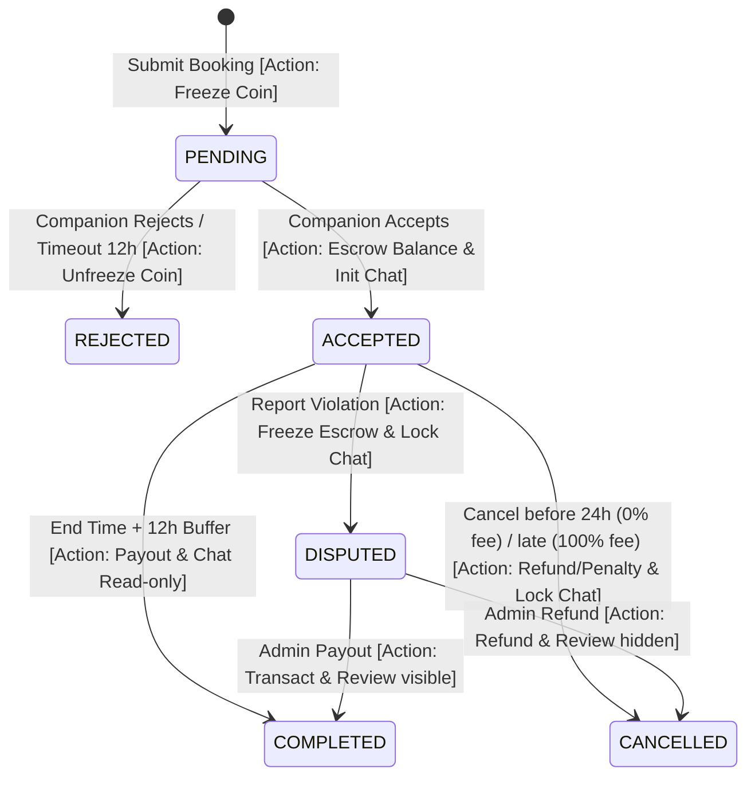
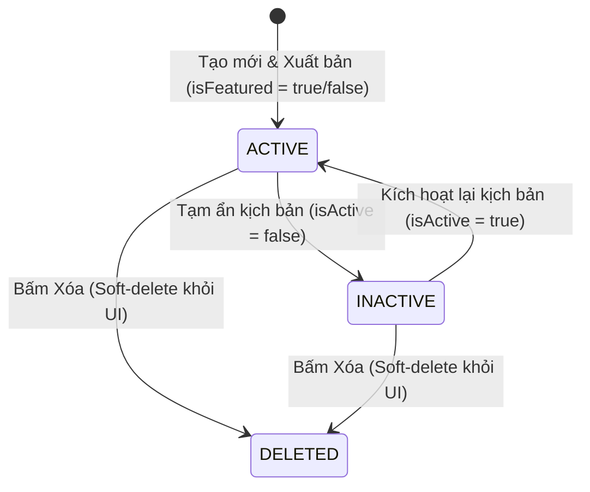

# FE STATE MACHINE SPECIFICATION (Concise Edition)

**Hệ thống:** Rent-a-Girlfriend Platform (`rent-a-gf-fe`) | **Tài liệu gốc:** [`user-flow.md`](./user-flow.md)  
**Quyết định kiến trúc:** [ADR 0001](../adr/0001-frontend-architecture.md), [ADR 0002](../adr/0002-nextjs-route-driven-flows.md)

---

## 1. CORE CLIENT-SIDE STATE MACHINES

### 1.1. Booking & Escrow State Machine
Quản lý trạng thái cuộc hẹn và dòng chảy tài chính Kano-Coin tương ứng trên UI.

### 1.2. Chat Session & SSE Connection FSM
Quản lý trạng thái kết nối realtime và quyền nhắn tin của phòng chat.
*   **CLOSED**: Chat popup đóng. Hủy kết nối SSE để giải phóng tài nguyên.
*   **CONNECTING**: Chat popup mở, đang kết nối SSE (`new EventSource`) & fetch history. Vô hiệu hóa input.
*   **ACTIVE**: SSE connected. Cho phép gửi tin. Áp dụng *Optimistic Update* (`sending` tag) khi gửi HTTP POST.
*   **DISCONNECTED**: Mất kết nối. Hiện banner cảnh báo. Chuyển sang *Short Polling* (5s/lần) và tự động reconnect ngầm.
*   **READONLY** (Completed + 24h): Khóa ô nhập tin. Chỉ cho phép xem lịch sử trò chuyện.
*   **LOCKED** (Cancelled / Disputed): Ngắt kết nối SSE ngay lập tức, khóa cứng ô nhập tin nhắn.

### 1.3. VNPay Wallet Transaction FSM
Bảo vệ số dư ví, chống race condition giữa webhook IPN và page return.
1.  **IDLE**: Form nhập số tiền sẵn sàng.
2.  **INITIATED**: Click nạp tiền -> Gọi API tạo cổng thanh toán -> Redirect sang VNPay.
3.  **POLLING_IPN**: Khách quay lại `/wallet/topup/processing`. Hiện loading overlay, chặn click Back/F5. Mở kết nối SSE lắng nghe trạng thái nạp tiền từ webhook IPN (polling 2s/lần nếu SSE lỗi, tối đa 5 lần).
4.  **SUCCESS_SYNCED**: Nhận event thành công -> Show Success UI, invalidates query `['wallet-balance']`.
5.  **FAILED_ROLLBACK**: Thanh toán thất bại hoặc timeout 15 phút -> Show Failure UI, khôi phục số dư cũ.

### 1.4. Companion Upgrade Wizard FSM
Quản lý luồng thiết lập hồ sơ nâng cấp tài khoản từ Client lên Companion, bảo toàn dữ liệu nháp của người dùng.
*   **Steps**: `UPGRADE_REQUEST` (bấm nút đăng ký từ profile) -> `BASIC_INFO` -> `ALBUM_UPLOAD` -> `VOICE_UPLOAD` -> `SCENARIOS` -> `PENDING_REVIEW`.
*   **Draft Auto-save**: Tự động lưu form state vào `localStorage` sau mỗi 5 giây.
*   **Recovery on Mount**: Tự động khôi phục dữ liệu nháp và đưa ứng viên về đúng step đang làm dở khi reload.
*   **Rejection Recovery**: Nhận event `ONBOARDING_REJECTED` từ SSE -> Redirect sang trang `/onboarding/companion/rejected` -> Hiện Alert lý do đỏ -> Unlock form edit.

### 1.5. Scenario Lifecycle & Management Form FSM
Quản lý trạng thái hiển thị của kịch bản và luồng bất đồng bộ của form Thêm/Sửa kịch bản.

#### A. Scenario Lifecycle (Trạng thái hiển thị kịch bản)

*Lưu ý:* Việc xóa kịch bản ở FE chỉ ẩn kịch bản khỏi các lượt đặt mới. Đối với các booking cũ đang chạy, kịch bản được đóng băng dạng `Snapshot` bất biến ở database.

#### B. Scenario Management Form FSM (Trạng thái Form nhập liệu)
1. **IDLE**: Form trống (Thêm mới) hoặc lấy thông tin kịch bản cũ (Chỉnh sửa). Nút "Lưu" hoạt động.
2. **VALIDATING**: Form tự động validate khi nhập liệu. Nút "Lưu" bị `disabled` nếu có bất kỳ trường nào vi phạm (Ví dụ: tên kịch bản trùng lặp, giá nằm ngoài khoảng 100 - 10.000 Kano-Coin, thời lượng ngoài 1h - 8h).
3. **SUBMITTING**: Click "Lưu" -> Khóa cứng toàn bộ inputs (`readonly`), chuyển nút bấm sang trạng thái disabled kèm Spinner và gửi request API (kèm Idempotency Key).
4. **SUCCESS**: Nhận phản hồi thành công từ BFF -> Đóng Form/Bottom sheet, hiển thị Toast thông báo và invalidates query `['companion-scenarios']` để đồng bộ lại danh sách trên giao diện.
5. **ERROR**: Nhận mã lỗi từ server (Ví dụ: `DUPLICATE_SCENARIO_NAME`, `SCENARIO_LIMIT_EXCEEDED`) -> Mở khóa inputs, hiển thị thông điệp lỗi tương ứng và giữ lại dữ liệu đang nhập để sửa tiếp.

---

## 2. FE IMPLEMENTATION RULES

### 2.1. Local FSM (Zustand)
Sử dụng Zustand để quản lý local state của các FSM có độ phức tạp giao diện cao (Chat Connection, Onboarding Wizard).
*   Chỉ cập nhật state thông qua các transitions (events) định sẵn trong store.
*   Đảm bảo dọn dẹp triệt để side-effects (close SSE stream, stop audio player) khi unmount component.

### 2.2. Global Sync (React Query Invalidation)
Sử dụng React Query cache làm Single Source of Truth cho Booking & Escrow FSM.
*   Không lưu trạng thái booking trong local client state.
*   Khi nhận SSE event biến động trạng thái (BFF broadcast), gọi `queryClient.invalidateQueries` để tự động refetch ngầm, cập nhật UI tức thời, loại bỏ hoàn toàn rủi ro desync dữ liệu giữa các tab trình duyệt.

### 2.3. Transaction Guards
*   Khóa cứng UI (readonly/disabled) ngay khi submit mutation để tránh duplicate request.
*   Bắt buộc gửi kèm **UUIDv4 Idempotency Key** ở header của các giao dịch ví và đặt lịch.
