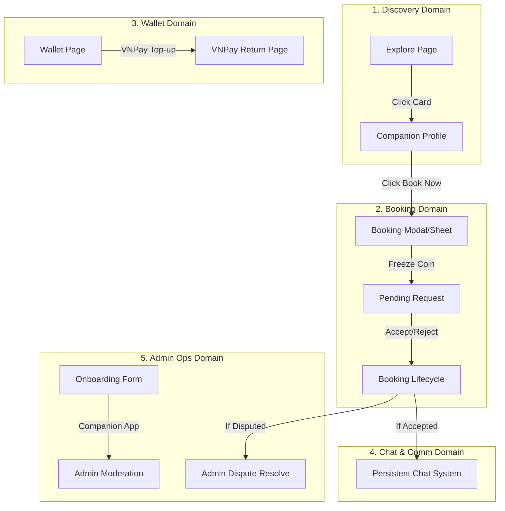

# USER FLOW DOCUMENT (UX STATE MACHINE & INTERACTION SPECIFICATION)

**Hệ thống:** Rent-a-Girlfriend Platform (Monorepo `rent-a-gf-fe`)  
**Ứng dụng áp dụng:** `apps/web` (Client-facing App Router) & `apps/admin` (Dashboard CSR)  
**Tài liệu liên quan:** [`information-architecture.md`](./information-architecture.md), [`frontend_vision_scope.md`](./frontend_vision_scope.md), [`BRD.md`](./BRD.md)  
**Quyết định kiến trúc:** [ADR 0001](../adr/0001-frontend-architecture.md), [ADR 0002](../adr/0002-nextjs-route-driven-flows.md)
**Ngày cập nhật:** 2026-05-17  

---

## 1. FLOW PHILOSOPHY

Triết lý thiết kế luồng người dùng (User Flow) của chúng tôi đặt tính **Dự đoán được (Predictability)**, **Nhất quán (Consistency)** và **Khôi phục được (Recoverability)** lên hàng đầu nhằm mang lại trải nghiệm production-grade không đứt gãy.

### 1.1. Context-preserving Navigation
Chúng tôi triệt để loại bỏ mô hình chuyển hướng trang (hard navigation) không cần thiết ở các tác vụ mang tính giao dịch hoặc tương tác nhanh. 
*   **Desktop:** Ưu tiên sử dụng Route-driven Modals (Next.js Intercepting & Parallel Routes) và Right Slide-over Drawers. Người dùng có thể thực hiện đặt lịch, xem thông báo, hoặc nhắn tin mà không bị mất vị trí cuộn trang (scroll position) hay dữ liệu nền của trang cũ.
*   **Mobile:** Chuyển đổi linh hoạt từ Modal/Drawer sang **Fullscreen Bottom Sheets** (vuốt để đóng) hoặc **Fullscreen Routes** chuyên biệt để tối ưu hóa không gian hiển thị và loại bỏ xung đột bàn phím ảo (soft keyboard conflict).

### 1.2. Idempotent & Deterministic Async States
Mọi hành động gửi yêu cầu bất đồng bộ (mutation) lên BFF đều phải tuân thủ nguyên tắc deterministic:
*   Khóa tương tác (disable CTA/inputs) ngay khi trigger để ngăn chặn double-submit.
*   Tất cả các API mutation có tác động đến tài chính (Wallet, Booking) bắt buộc phải đính kèm **Idempotency Key** sinh từ Client nhằm loại bỏ rủi ro trùng lặp request ở backend do ngắt kết nối mạng giữa chừng.
*   Tránh "loading loop" vô chậm bằng cách áp dụng cơ chế timeout nghiêm ngặt (10s cho Explore, 15s cho Transactions/Booking) đi kèm chính sách retry tự động và thông báo lỗi rõ ràng cho người dùng.

### 1.3. Optimistic UI & Robust Rollback Strategy
Để tạo cảm giác mượt mà tức thì cho các tương tác nhẹ (như Yêu thích - Favorites, gửi tin nhắn chat), chúng tôi áp dụng Optimistic Updates qua TanStack Query:
1.  **Bước 1:** Ghi đè bộ nhớ cache local ngay khi người dùng click (UI thay đổi ngay lập tức).
2.  **Bước 2:** Lưu lại snapshot của cache cũ trước khi cập nhật.
3.  **Bước 3:** Gửi request lên server ngầm.
4.  **Bước 4:** Nếu request thành công, giữ nguyên. Nếu thất bại, tự động phục hồi (rollback) về snapshot cũ và hiển thị Toast thông báo lỗi.

### 1.4. Real-time State Reconciliation
Thay vì cố gắng duy trì state phức tạp và tự merge thủ công (dễ gây desync dữ liệu giữa các tab hoặc thiết bị khác nhau), FE hoạt động trên triết lý **Backend is the Single Source of Truth**. Khi nhận được Event thay đổi trạng thái từ SSE (Server-Sent Events) stream, client kích hoạt cơ chế invalidation của React Query để tự động refetch ngầm, đảm bảo dữ liệu hiển thị luôn chính xác tuyệt đối.

---

## 2. FLOW INDEX

Toàn bộ các luồng giao diện của hệ thống được quản lý và cô lập theo các domain nghiệp vụ nghiêm ngặt nhằm giảm thiểu rủi ro lan truyền lỗi (Change Propagation):

---

## 3. MỤC LỤC CHI TIẾT 9 LUỒNG NGHIỆP VỤ (FLOW SPECS)

Để tối ưu hóa việc quản lý và tránh phình to tài liệu, đặc tả chi tiết của từng luồng nghiệp vụ được chia tách thành các file chuyên biệt theo cấu trúc Domain-Driven:

| Thứ tự | Luồng nghiệp vụ (Flow Name) | Mô tả tóm tắt | File đặc tả chi tiết (Tài liệu liên kết) |
| :---: | :--- | :--- | :--- |
| **01** | **Discovery Flow** | Khám phá Magazine View, tìm kiếm & bộ lọc Companion thông minh, nghe Voice Intro. | 📑 **[Discovery Flow Spec](./flow/01-discovery.md)** |
| **02** | **Booking Creation Flow** | Đặt lịch Companion, URL-driven modal, quy trình đóng băng coin (Freeze Balance). | 📑 **[Booking Creation Flow Spec](./flow/02-booking-creation.md)** |
| **03** | **Booking Lifecycle Flow** | Tiếp nhận, phê duyệt (Accept/Reject), hoàn thành cuộc hẹn và chuyển đổi Escrow. | 📑 **[Booking Lifecycle Flow Spec](./flow/03-booking-lifecycle.md)** |
| **04** | **Wallet Topup Flow** | Nạp Kano-Coin qua VNPay, giải quyết race condition IPN Webhook và Page Return. | 📑 **[Wallet Topup Flow Spec](./flow/04-wallet-topup.md)** |
| **05** | **Chat & Communication Flow** | Hệ thống chat text realtime, cơ chế chèn tin nhắn an toàn, tự động khóa sau 24h. | 📑 **[Chat & Comm Flow Spec](./flow/05-chat-communication.md)** |
| **06** | **Notification Flow** | Nhận thông báo thời gian thực qua SSE, Toast notification và điều hướng thông minh. | 📑 **[Notification Flow Spec](./flow/06-notification.md)** |
| **07** | **Companion Upgrade & Approval Flow** | Nâng cấp tài khoản Client lên Companion, điền hồ sơ (Voice, Scenarios) và Admin phê duyệt. | 📑 **[Companion Upgrade Flow Spec](./flow/07-companion-approval.md)** |
| **08** | **Dispute Flow** | Báo cáo vi phạm (No-show), đóng băng Escrow, Admin phân định tài chính. | 📑 **[Dispute Flow Spec](./flow/08-dispute.md)** |
| **09** | **Companion Scenario Management Flow** | Tự định nghĩa kịch bản (Scenarios) và định giá dịch vụ, tối ưu hóa doanh thu. | 📑 **[Companion Scenario Management Flow Spec](./flow/09-companion-scenario-management.md)** |

---

## 4. NEXT.JS PATTERNS MATRIX

*   **Parallel & Intercepting Routes:** Sử dụng `@modal/(.)booking` ở desktop để đặt lịch giữ nguyên scroll trang nền. Mobile tự động route full-page.
*   **Persistent Layout:** Hệ thống chat và thông báo mount tại `app/(shared-authenticated)/layout.tsx` để bảo toàn kết nối SSE khi chuyển trang.
*   **Streaming SSR:** Bọc grid Explore trong `<Suspense fallback={<ExploreSkeleton />}>` để tăng TTFB và tối ưu hóa FCP.
*   **TanStack Query Invalidation:** Lắng nghe SSE event để tự động invalidate cache, đồng bộ trạng thái ví và booking ngay lập tức.

---

## 5. SUMMARY OF EXPECTED BEHAVIORS

*   **Không giật lag (Smoothness):** Click "Yêu thích" hoặc gửi tin nhắn Chat hiển thị ngay lập tức nhờ Optimistic Update. Rollback diễn ra êm ái nếu lỗi mạng.
*   **Không đặt lịch ảo (Idempotency):** Người dùng bấm đặt lịch dồn dập cũng không bao giờ bị trừ tiền 2 lần nhờ khóa CTA DOM và cơ chế Idempotency Key gửi lên BFF.
*   **Không desync dữ liệu (Realtime consistency):** Trạng thái booking thay đổi từ bất kỳ đâu (Admin duyệt, Companion accept, Timeout tự động) đều hiển thị tức thời trên màn hình Client qua SSE + React Query Invalidation.
*   **Không vỡ giao diện di động (Mobile optimization):** Không sử dụng Modal nhỏ trên di động. Mọi form dài hoặc chi tiết phức tạp đều được tự động chuyển đổi sang Fullscreen Bottom Sheet hoặc Fullscreen Route chuyên biệt có xử lý chống bàn phím ảo che khuất nút bấm.
*   **An toàn tài chính tuyệt đối (Escrow processing):** Giao dịch ví qua VNPay có màn hình chờ trung gian xử lý race condition giữa Webhook và Redirect Return, loại bỏ hoàn toàn tình trạng nạp tiền thành công nhưng số dư không tăng.

Tài liệu này được biên soạn bởi Senior Product Architect & Senior Frontend Architect để làm kim chỉ nam phát triển hệ thống frontend cho dự án Rent-a-Girlfriend.
