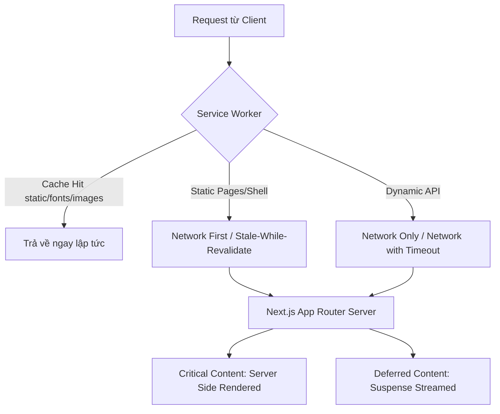
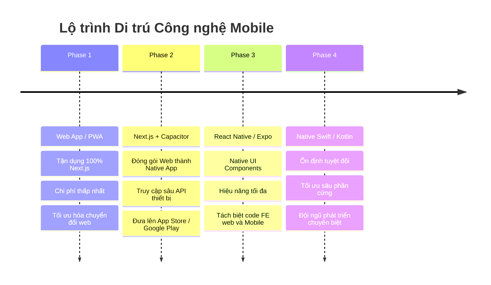

# Đánh giá và Thiết kế Kiến trúc PWA cho Dự án Next.js 16 (Mobile-First)

Tài liệu này cung cấp một đánh giá toàn diện và thiết kế kiến trúc để chuyển đổi dự án Next.js 16 hiện tại sang Progressive Web App (PWA) nhằm tối ưu hóa trải nghiệm trên thiết bị di động (Mobile-First) mà không cần xây dựng ứng dụng Native hoặc Hybrid (React Native/Expo) ngay lập tức.

---

## 1. Executive Summary

Chuyển đổi dự án Next.js sang Progressive Web App (PWA) là một chiến lược thực dụng để đạt được trải nghiệm giống như ứng dụng di động bản địa (native-like) với chi phí tối thiểu.

### Đánh giá nhanh:
*   **Khả năng thay thế:** PWA hoàn toàn có thể thay thế Mobile App đối với các ứng dụng SaaS, quản lý, đặt dịch vụ (Rent-a-GF), thương mại điện tử, nơi mà trải nghiệm tương tác (tải nhanh, offline cơ bản, đẩy thông báo) là yếu tố quyết định, chứ không phải các tính năng phần cứng chuyên sâu (NFC, Bluetooth, Contacts).
*   **Next.js 16 & React 19:** Kiến trúc App Router, Server Components và Partial Prerendering (PPR) của Next.js 16 cung cấp nền tảng xuất sắc để phân tách Critical Content (render nhanh trên server) và Deferred Content (stream qua Suspense). Sự kết hợp này với Service Worker tối ưu hóa việc phân phối nội dung và giảm thiểu Fetch Waterfall.
*   **Chiến lược Thư viện (Thống nhất qua Phỏng vấn):** Sử dụng **Vanilla Service Worker (`public/sw.js`)** và **React Server Actions** theo tài liệu chính thức của Next.js. Giải pháp này giúp mã nguồn Next.js 16 sạch sẽ, tương thích 100% với **Turbopack** (`next dev --turbo`), tránh các nợ kỹ thuật của các Webpack plugins bên thứ ba (như `next-pwa`, `Serwist`).

---

## 2. Architectural Principles (Nguyên lý Kiến trúc)

Kiến trúc PWA cho Next.js 16 tuân thủ nghiêm ngặt mô hình thiết kế **Server First** và **URL as State**:



### 1. Server First & Client Boundary
* Mọi trang mặc định là **Server Component**. Service Worker sẽ cache bộ khung (App Shell) hoặc trang HTML tĩnh được revalidate.
* **Client Boundaries (Client Components)** được giữ ở mức tối thiểu (ví dụ: nút bấm tương tác, Trình phát nhạc, nút Đặt lịch). Điều này giúp giảm dung lượng JS cần tải xuống, tối ưu hóa bộ nhớ và tăng tốc độ khởi chạy PWA trên các thiết bị cấu hình thấp.

### 2. URL As State (Mọi trạng thái nghiệp vụ nằm ở URL)
* Trạng thái lọc, sắp xếp, trang, Scenario ID phải được lưu trên URL (`?page=2`, `?companionId=123`).
* Khi PWA bị crash hoặc hệ điều hành tắt chạy ngầm (tình trạng phổ biến trên iOS khi thiếu RAM), PWA khi mở lại có thể khôi phục chính xác trạng thái thông qua URL mà không cần duy trì state phức tạp trong Local Storage hay Global State (Zustand/Redux).

### 3. Partial Prerendering (PPR) & Suspense Cache
* Nội dung quan trọng (Hero, Tên companion, Giá) được cache ở dạng tĩnh (Static Shell).
* Nội dung trì hoãn (Đánh giá, Gợi ý, Lịch sử) được tải sau qua `Suspense` và API Stream. Service Worker sẽ bỏ qua cache cho các stream này hoặc áp dụng chiến lược **Network First** với thời hạn tối đa 5 giây để tránh chặn rendering của App Shell.

---

## 3. Current Industry Best Practices (Xác minh năm 2026)

Trạng thái hỗ trợ PWA trên các trình duyệt đã có nhiều thay đổi đáng kể:

### Trình duyệt & OS Vendors (Chrome & Safari iOS)
* **iOS Safari (iOS 16.4 đến nay - iOS 19/20 năm 2026):**
  * Hỗ trợ **Web Push API** đầy đủ thông qua chuẩn VAPID (W3C Push API). Tuy nhiên, **bắt buộc** người dùng phải thực hiện thao tác "Add to Home Screen" (Thêm vào MH chính) thì ứng dụng mới có quyền đăng ký Push Token.
  * Hỗ trợ **Badging API** (hiển thị số thông báo màu đỏ trên icon ứng dụng ở màn hình chính).
  * Quy chế giới hạn dung lượng lưu trữ: iOS Safari giới hạn dung lượng cache của Service Worker tối đa khoảng 60% dung lượng trống của thiết bị, nhưng nếu ứng dụng không được mở trong vòng **7 ngày liên tục**, iOS có quyền tự động xóa toàn bộ Storage/Cache của Service Worker đó để giải phóng bộ nhớ.
  * *Hệ quả:* Phải có cơ chế sao lưu dữ liệu quan trọng lên cloud và đồng bộ khi online.
* **Google Chrome (Android & Desktop):**
  * Hỗ trợ cài đặt trực tiếp từ thanh địa chỉ mà không cần qua menu chia sẻ (In-app Install Prompt qua sự kiện `beforeinstallprompt`).
  * Dung lượng lưu trữ cache động lên tới 60% tổng dung lượng ổ đĩa trống và không bị xóa sau 7 ngày như iOS.
  * Hỗ trợ Web Push API chạy ngầm (Silent Push) qua FCM hoặc VAPID trực tiếp.

### Trạng thái bảo trì của các thư viện Next.js PWA:
1.  **`next-pwa`:** Đã dừng bảo trì tích cực từ lâu. Gây ra nhiều lỗi xung đột với Next.js App Router và React 19.
2.  **`Serwist`:** Là thư viện kế nhiệm được Next.js chính thức đề xuất trong docs. Tuy nhiên, nó vẫn yêu cầu can thiệp sâu cấu hình Webpack, cản trở sự phát triển của Turbopack.
3.  **Khuyến nghị:** Đi theo chỉ dẫn chính thức từ Vercel: sử dụng **Vanilla Service Worker** (`sw.js`) và **Server Actions** để tối ưu hóa sự tinh gọn và bảo trì dễ dàng.

---

## 4. Recommended Architecture (Thiết kế Kiến trúc)

### 1. Web App Manifest (`manifest.json` hoặc `/app/manifest.ts`)
Sử dụng dynamic manifest thông qua Next.js Metadata API để tự động cấu hình dynamic theme hoặc localize.

```typescript
// src/app/manifest.ts
import { MetadataRoute } from 'next';

export default function manifest(): MetadataRoute.Manifest {
  return {
    name: 'Rent a Girlfriend Mobile',
    short_name: 'RentGF',
    description: 'Trải nghiệm tìm kiếm và trò chuyện cùng Companion',
    start_url: '/',
    display: 'standalone',
    background_color: '#0f172a', // Slate 900
    theme_color: '#0f172a',
    orientation: 'portrait-primary',
    icons: [
      {
        src: '/icons/icon-192x192.png',
        sizes: '192x192',
        type: 'image/png',
        purpose: 'maskable' // Bắt buộc cho Android thích ứng icon tròn/vuông
      },
      {
        src: '/icons/icon-512x512.png',
        sizes: '512x512',
        type: 'image/png',
        purpose: 'any'
      }
    ],
    shortcuts: [
      {
        name: 'Trò chuyện',
        url: '/messages',
        icons: [{ src: '/icons/chat.png', sizes: '192x192' }]
      },
      {
        name: 'Khám phá',
        url: '/explore',
        icons: [{ src: '/icons/explore.png', sizes: '192x192' }]
      }
    ]
  };
}
```

### 2. Service Worker & Caching Strategies

Chúng ta phân chia tài nguyên và áp dụng chiến lược Cache cụ thể:

| Loại Tài Nguyên | Chiến Lược Cache | Chi tiết cấu hình & Lý do chọn |
| :--- | :--- | :--- |
| **HTML (App Shell / Pages)** | **Network First** (với fallback offline) | Ưu tiên nội dung mới nhất từ Server (do là Server Component). Nếu mất mạng (Offline), lập tức trả về App Shell tĩnh để hiển thị giao diện "Bạn đang ngoại tuyến". |
| **API Response (GraphQL/REST)** | **Stale-While-Revalidate** (chỉ dành cho GET) | Ví dụ: Danh sách Companion, Hồ sơ cá nhân. Trả về dữ liệu cũ ngay lập tức để màn hình không bị trống (Instant Load), đồng thời fetch ngầm để cập nhật UI. |
| **API Mutations (POST/PUT/DELETE)**| **Network Only** + Vô hiệu hóa offline | Tuyệt đối không thực hiện ghi dữ liệu khi offline. Vô hiệu hóa các nút bấm tương tác viết khi ngoại tuyến để tránh conflict dữ liệu và đơn giản hóa MVP. |
| **Images (Avatar, Companion Photos)**| **Cache First** (với LRU Expiration) | Ảnh Unsplash/Pravatar tốn tài nguyên tải. Cache cứng trong Cache Storage. Cấu hình tự động xóa ảnh cũ nếu số lượng vượt quá 100 ảnh hoặc sau 30 ngày. |
| **Fonts & Static Assets (CSS, JS)** | **Cache First** (Cache vĩnh viễn) | Các tệp JS/CSS của Next.js có hash duy nhất trong tên (`main-[hash].js`). Cache vĩnh viễn cho đến khi có bản build mới làm thay đổi hash. |

---

## 5. Audit Dự án Next.js & Đánh giá Khả năng Offline

### Phân tích Audit Các Yếu Tố Hệ Thống:

#### 1. Routing & Page Transitions
*   **Tại sao cần kiểm tra:** Next.js sử dụng Client-side routing mặc định qua `Link`. Khi mất mạng, nếu click sang trang chưa được prefetch, Next.js sẽ ném lỗi runtime.
*   **Rủi ro:** Trải nghiệm người dùng bị đứt gãy hoàn toàn.
*   **Giải pháp:** Đăng ký sự kiện offline và trả về trang `/offline` dự phòng qua Service Worker.

#### 2. Authentication (JWT/Cookie/Session)
*   **Tại sao cần kiểm tra:** Next.js 16 thường lưu Session trong HTTP-only Cookie để bảo mật. JavaScript client không thể đọc cookie này khi offline.
*   **Rủi ro:** Khi offline, Service Worker không thể kiểm tra xem session hiện tại còn hạn không để quyết định render App Shell nào.
*   **Giải pháp:** Lưu trữ một cờ trạng thái login (`is_logged_in: true`) trong IndexedDB ở Client để Service Worker có thể đọc và render giao diện Offline phù hợp.

#### 3. Push Notifications & Realtime State
*   **Tại sao cần kiểm tra:** Dự án hiện tại đang sử dụng Server-Sent Events (SSE). SSE chỉ chạy khi ứng dụng đang mở (Foreground).
*   **Rủi ro:** Người dùng lỡ các thông báo quan trọng khi app đóng.
*   **Giải pháp:** Chuyển sang Web Push Protocol (Chuẩn W3C) kết hợp Server Actions để gửi thông báo đẩy đến Service Worker chạy ngầm.

---

### Phân loại Chức năng Ngoại tuyến (Offline Capabilities):

*   **Fully Offline (Hoạt động hoàn toàn khi mất mạng):**
    *   *Xem danh sách Companion đã duyệt:* Đọc trực tiếp dữ liệu API cache (`Stale-While-Revalidate`).
    *   *Đọc tin nhắn cũ:* Đọc lịch sử hội thoại được ghi vào `IndexedDB`.
*   **Partially Offline (Vô hiệu hóa ghi):**
    *   *Gửi tin nhắn mới & Đặt lịch hẹn:* Vô hiệu hóa tương tác viết khi offline, hiển thị banner cảnh báo và nút thử lại khi có mạng.
*   **Online Required (Bắt buộc phải có mạng):**
    *   *Cổng thanh toán & Nạp tiền (Wallet):* Phải chuyển hướng trực tiếp ra Internet. Nếu offline, hiển thị ngay thông báo lỗi kết nối.

---

## 6. Mobile Capability Matrix

Bảng đánh giá khả năng hỗ trợ tính năng thiết bị giữa PWA (Web API tiêu chuẩn) so với Android và iOS:

| Tính Năng (Capability) | PWA Support | Android (Chrome) | iOS (Safari) | Giới hạn Kỹ thuật / Tài liệu Tham khảo |
| :--- | :--- | :--- | :--- | :--- |
| **Camera & Microphone** | **Đầy đủ** | Hoạt động tốt | Hoạt động tốt | Sử dụng `navigator.mediaDevices.getUserMedia()`. Trên iOS yêu cầu cấp quyền rõ ràng tại thời điểm sử dụng. |
| **GPS / Geolocation** | **Đầy đủ** | Hoạt động tốt | Hoạt động tốt | Sử dụng `navigator.geolocation`. Độ chính xác phụ thuộc vào việc trình duyệt được cấp quyền High Accuracy. |
| **Push Notifications** | **Một phần** | Đầy đủ | Chỉ khi thêm vào màn hình chính | iOS bắt buộc người dùng thực hiện thao tác "Add to Home Screen" mới cấp quyền đăng ký Web Push. Không hỗ trợ Silent Push ngầm trên iOS. |
| **File Upload** | **Đầy đủ** | Hoạt động tốt | Hoạt động tốt | Thông qua `<input type="file">`. iOS hỗ trợ truy cập kho ảnh hoặc camera trực tiếp. |
| **Background Sync** | **Một phần** | Đầy đủ | Không hỗ trợ | Trình duyệt Chrome hỗ trợ `SyncManager`. iOS Safari không hỗ trợ API này; phải sử dụng giải pháp đồng bộ thủ công khi app mở lại. |
| **Share API** | **Đầy đủ** | Hoạt động tốt | Hoạt động tốt | Sử dụng `navigator.share()` để gọi hộp thoại chia sẻ hệ điều hành. |
| **Biometric (FaceID/Finger)**| **Đầy đủ** | Hoạt động tốt | Hoạt động tốt | Sử dụng **WebAuthn API** (chuẩn W3C). Cho phép xác thực không cần mật khẩu bằng vân tay hoặc nhận diện khuôn mặt qua trình duyệt. |
| **NFC** | **Kém** | Chỉ Android | Không hỗ trợ | Web NFC API chỉ mới được thử nghiệm trên Chrome Android. iOS Safari hoàn toàn chặn truy cập NFC từ Web. |
| **Bluetooth** | **Kém** | Chỉ Android | Không hỗ trợ | Web Bluetooth API được hỗ trợ trên Chrome Android. iOS hoàn toàn không hỗ trợ vì lý do bảo mật. |
| **Contacts** | **Đầy đủ** | Hoạt động tốt | Hoạt động tốt | Sử dụng Chuẩn `navigator.contacts.select()` (Contact Picker API). Đã được hỗ trợ rộng rãi trên cả Safari và Chrome di động. |
| **Deep Linking** | **Một phần** | Đầy đủ | Không hỗ trợ tốt | PWA trên Android hỗ trợ Web App Manifest định nghĩa `share_target` và xử lý link trực tiếp. Trên iOS, PWA chỉ mở link của chính tên miền đó khi chạy độc lập (standalone mode). |

---

## 7. Security Review (Đánh giá Bảo mật)

### 1. Yêu cầu HTTPS bắt buộc
*   **Cơ chế:** Trình duyệt chỉ kích hoạt Service Worker trên các ngữ cảnh an toàn (Secure Contexts), tức là `https://` (hoặc `http://localhost` cho môi trường phát triển).
*   **Tại sao:** Service Worker hoạt động như một proxy trung gian có khả năng can thiệp và sửa đổi mọi request mạng. Nếu chạy qua HTTP thông thường, kẻ tấn công Man-in-the-Middle (MitM) có thể inject một Service Worker độc hại để chiếm đoạt hoàn toàn tài khoản người dùng.

### 2. Service Worker Hijacking & Cache Poisoning
*   **Mối đe dọa:** Nếu kẻ tấn công tìm thấy lỗ hổng XSS trên ứng dụng, chúng có thể ghi đè/đăng ký một Service Worker độc hại để chuyển hướng các request API của người dùng đến server giả mạo hoặc trích xuất dữ liệu nhạy cảm được cache.
*   **Biện pháp phòng ngừa:** 
    *   Cấu hình Header HTTP phản hồi cho tệp `sw.js`: `Service-Worker-Allowed: /` và đặc biệt là set `Cache-Control: no-cache, no-store, must-revalidate` để trình duyệt luôn kiểm tra phiên bản mới nhất của file sw.js mỗi khi người dùng truy cập.
    *   Sử dụng Content Security Policy (CSP) chặt chẽ, cấm thực thi Inline Scripts không có nonce/hash.

### 3. Chiến lược lưu trữ Token (JWT/Session) an toàn
*   **Trạng thái offline:** Khi offline, Cookie HTTP-only không khả dụng cho Javascript đọc.
*   **Khuyến nghị:**
    *   **Access Token (Thời hạn ngắn):** Có thể lưu trữ trong bộ nhớ tạm (Memory/State) của Client App.
    *   **Refresh Token (Thời hạn dài):** Tuyệt đối KHÔNG lưu trong LocalStorage vì LocalStorage rất dễ bị tấn công XSS đọc trộm. Thay vào đó, hãy lưu trong **HTTP-only, Secure, SameSite=Strict Cookie**. Service Worker sẽ tự động đính kèm Cookie này khi thực hiện các request ngầm gửi lên server (như Refresh Token API) do trình duyệt tự động quản lý.
    *   **Dữ liệu nhạy cảm ngoại tuyến:** Mã hóa dữ liệu lưu trong `IndexedDB` bằng một khóa bí mật được sinh ra động (Session-based key) lưu trong Memory, để khi ứng dụng bị tắt, dữ liệu trong IndexedDB không thể bị đọc trộm bởi các phần mềm độc hại khác trên cùng thiết bị.

---

## 8. Future Migration Strategy (Lộ trình Di trú)

Khi PWA không còn đáp ứng đủ nhu cầu tăng trưởng hoặc trải nghiệm (ví dụ: cần thanh toán In-App Purchase trên App Store, cần truy cập Bluetooth/NFC sâu), chúng ta áp dụng lộ trình chuyển đổi 4 giai đoạn:



---

## 9. Concrete Implementation Steps (Các Bước Cài Đặt Thực Tế)

Các bước triển khai được thực hiện tương tự như mô tả trong [Tài liệu ADR 0004](file:///e:/LEARN/rent-a-gf-fe/docs/adr/0004-mobile-pwa-architecture.md#L104).
*   **Bước 1:** Khởi tạo Manifest động tại `src/app/manifest.ts`.
*   **Bước 2:** Thiết lập Service Worker tại `public/sw.js` lắng nghe push.
*   **Bước 3:** Tạo Server Actions cho Web Push tại `src/app/actions.ts` kết hợp với database của BFF để quản lý subscriptions.
*   **Bước 4:** Tạo Component Đăng ký và Xin quyền thông báo ở Client.
*   **Bước 5:** Đăng ký Service Worker ngầm tại Root Layout.
*   **Bước 6:** Thiết lập Custom HTTP Headers cho `/sw.js` trong `next.config.ts` để chặn caching.
